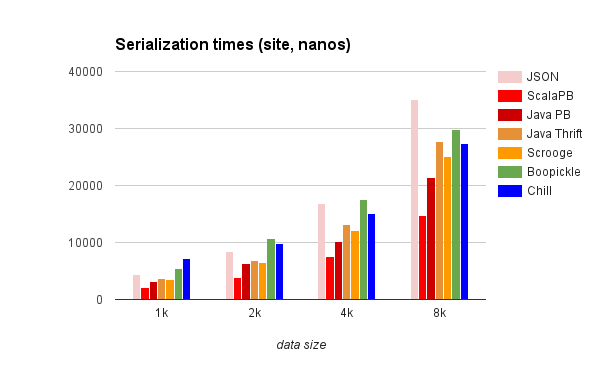
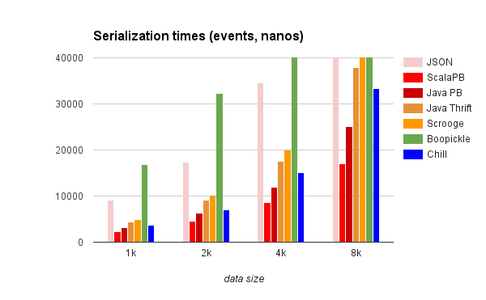
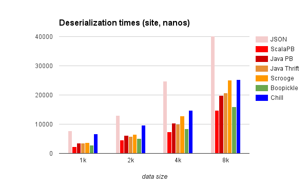
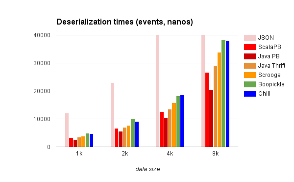

*UPD*: Recent benchmark charts are [here](/charts/scala-serialization/).

It’s common to use [JSON](http://json.org/) as the main format of serialized data.
It’s very convenient to use it both on client and server. Obviously, it’s not
the best choice in terms of both data size and performance.

This article mainly focused on data size/performance of binary serialization
libraries for [Scala](http://www.scala-lang.org/). Java versions are used just to compare with.

## TL;DR

Protobuf is small and fast. Scala’s implementation — ScalaPB — is robust
and convenient. Both for many small and big messages.

## Use cases

Many performance tests suffers from a synthetic nature of data. This test is not
an exception, but here I test existing almost-production like data models
(simplified a bit, of course). One case is a rich [DTO](https://en.wikipedia.org/wiki/Data_transfer_object)
(data transfer object), the second one is a list of small
[events](http://martinfowler.com/eaaDev/EventSourcing.html) from which a rich DTO could be reconstructed.

## Tested libraries

I chose several libraries for a testing:
* [ScalaPB](https://github.com/trueaccord/ScalaPB). A Google [Protocol Buffers](https://developers.google.com/protocol-buffers/)
compiler implementation for Scala. All data objects are case classes, all
protobuf features are supported.
* [Pickling](https://github.com/scala/pickling). Meant to be a Scala alternative to default
[Java serialization](https://docs.oracle.com/javase/8/docs/technotes/guides/serialization/index.html). Uses macros to generate
serializers/parsers (picklers/unpicklers in its terminology).
* [Boopickle](https://github.com/ochrons/boopickle). Custom binary format without
backward-compatibility. Also uses macros.
* [Chill](https://github.com/twitter/chill). Twitter’s extension for [Kryo](https://github.com/EsotericSoftware/kryo).
* [Scrooge](https://twitter.github.io/scrooge/). A [Thrift](https://thrift.apache.org/) compiler
implementation for Scala.

For Protobuf and Thrift, I also used Java implementation to check compatibility
and performance with the original. Also, I added to comparison a default
Java Serialization (Serializable interface + ObjectInputStream).

All libraries I checked against well-known JSON serialization
library — [Jackson](https://github.com/FasterXML/jackson).

It’s worth to mention couple libraries, that I decided not to include a comparison:
* [Protostuff](http://www.protostuff.io/). An interesting library, supports
protobuf and its own binary format, but… It’s hard to support Scala Collections
there (without changes inside library it’s impossible).
* [MsgPack](http://msgpack.org/index.html). Scala implementation of this library doesn’t
support case classes. The idea is interesting — to replace quotes, colons etc.,
but the gain is ~25%. Doesn’t seem to be a big deal.

Also, I want to promote an interesting
research — [JVM Serializers](https://github.com/eishay/jvm-serializers). It’s a good starting
point to pick your serialization library.

## Test data models

I tested libraries against two types of data objects:

1. Site — a rich data transfer object with fields, lists etc.
2. Events — a list of simple flat objects with at most 4 flat fields.

### Site

A [rich DTO](https://github.com/dkomanov/scala-serialization/blob/master/src/main/scala/com/komanov/serialization/domain/Site.scala) consists of several fields with simple
data types ([UUID](https://docs.oracle.com/javase/7/docs/api/java/util/UUID.html), dates, strings, etc) and nested
lists of other rich objects (without back-references). Also, there are couple
rich objects with subclasses (see an example of EntryPoint).

The Site represents a web-site: contains information about pages, meta tags,
entry points and other meta information.

```scala
case class Site(id: UUID,
                ownerId: UUID,
                revision: Long,
                siteType: SiteType,
                flags: Seq[SiteFlag],
                name: String,
                description: String,
                domains: Seq[Domain],
                defaultMetaTags: Seq[MetaTag],
                pages: Seq[Page],
                entryPoints: Seq[EntryPoint],
                published: Boolean,
                dateCreated: Instant,
                dateUpdated: Instant)
sealed trait EntryPoint
final case class DomainEntryPoint(domain: String,
                                  primary: Boolean)
  extends EntryPoint {
}
final case class FreeEntryPoint(userName: String,
                                siteName: String,
                                primary: Boolean)
  extends EntryPoint {
}
```

### Events

I’ve implemented as simple as possible [event model](https://github.com/dkomanov/scala-serialization/blob/master/src/main/scala/com/komanov/serialization/domain/Events.scala)
for building Site snapshot (as if it was event sourced). All events are very
small, represents a single change in a model (very granular):

```scala
sealed trait SiteEvent

case class SiteCreated(id: UUID, ownerId: UUID, siteType: SiteType) extends SiteEvent

case class SiteNameSet(name: String) extends SiteEvent

case class SiteDescriptionSet(description: String) extends SiteEvent

case class SiteRevisionSet(revision: Long) extends SiteEvent

case class SitePublished() extends SiteEvent
// etc
```

Events come as a sequence, ordered by a timestamp. For example, in MySQL, it could be stored in such table:
```sql
CREATE TABLE site_events (
  id BINARY(16) NOT NULL,
  timestamp BIGINT NOT NULL,
  event_type INT NOT NULL,
  event_digest MEDIUMBLOB NOT NULL,
  PRIMARY KEY (id)
) ENGINE=InnoDB;
```

An example of how to reconstruct a Site from events
([EventProcessor](https://github.com/dkomanov/scala-serialization/blob/master/src/main/scala/com/komanov/serialization/domain/EventProcessor.scala)):

```scala
def apply(list: Seq[SiteEventData]): Site = {
  list.foldLeft(emptySite) {
    case (s, SiteEventData(_, SiteRevisionSet(rev), dateUpdated)) =>
      s.copy(revision = rev, dateUpdated = dateUpdated)

    case (s, SiteEventData(_, SiteNameSet(name), _)) =>
      s.copy(name = name)
...
```

## Tests

There are 5 objects (Site) to test: 1k, 2k, 4k, 8k, and 64k. This mnemonic means:
1k is the object, that is present as approximately 1 kilobyte JSON;
2k is ~2 kilobyte JSON etc.

Events are produced from these 5 objects: 1k events are events from which may be
reconstructed a 1k object, etc.

### Data size

Sizes (in bytes) for Site (rich DTO):

```
Converter     1k    2k    4k    8k    64k
JSON        1060  2076  4043  8173  65835
Boopickle    544  1130  1855  2882  16290
Protobuf     554  1175  1930  3058  27111
Thrift       712  1441  2499  4315  38289
Chill        908  1695  2507  3643  26261
Java        2207  3311  4549  6615  43168
Pickling    1628  2883  5576 11762  97997
```

BooPickle is the leader (and this is understandable — this library doesn’t
support backward compatibility, so, they don’t need to save field tags). Chill
demonstrates better results for the very big object. Thrift is not so good
(maybe, it’s because of implementation for optional fields).

Sizes (in bytes) for events (sum for all events in list):

```
Converter     1k    2k    4k    8k    64k
JSON        1277  2499  5119 10961 109539
Boopickle    593  1220  2117  3655  42150
Protobuf     578  1192  2076  3604  42455
Thrift       700  1430  2639  4911  57029
Chill        588  1260  2397  3981  47048
Java        2716  5078 11538 26228 240267
Pickling    1565  3023  6284 13462 128797
```

Now protobuf looks even better.

Protobuf, thrift, chill and boopickle are almost 2.5 times more compact than JSON.
Big object serializes better with Java Serialization than Pickling,
and small objects — vice versa.

### Data size and compression

Another interesting topic about data size is the compression. A compression is
widely used in modern systems, from databases
(i.e. “compress” row format in [MySQL](https://dev.mysql.com/doc/refman/5.6/en/innodb-compression.html))
to networks ([GZip over HTTP](https://en.wikipedia.org/wiki/HTTP_compression)). So, the data size
could be not so important to look at. The comparison table for gzipped and raw
object are pretty big, I will show a small part
(an entire table available [here](https://docs.google.com/spreadsheets/d/1BpI1GCMBfk1MbXwtlHbTi-DJK2ur-VEWn7m2laQ9gos/edit?usp=sharing)).

```
Converter        site 2k  events 2k  site 8k  events 8k
JSON (raw)          2076       2499     8173      10961
JSON (gz)           1137       2565     2677      11784
Protobuf (raw)      1175       1192     3058       3604
Protobuf (gz)        898       1463     2175       5552
Thrift (raw)        1441       1430     4315       4911
Thrift (gz)          966       1669     2256       6673
```

Important note: events are gzipped not together, but one by one, of course,
if it would be gzipped together, result size would be much less. It shows an
importance of choosing the right storage/transfer mechanism.

We may see, that on small objects (less that 2k) protobuf has almost the same
size as gzipped JSON (so, we can save some CPU cycles).

### Performance

The next important thing is the performance of serialization and deserialization
(parsing). Our tests are about serializing/deserializing the raw data to Scala
objects. In order to simplify this testing, I converted generated classes
to “domain” classes, so, for protobuf and thrift there is also an addition of
object conversion (I don’t think that the effect of this addition is significant).

I excluded Java Serialization and Pickling from this chart (and other charts also)
because both of them are very slow. I will write about it afterward.

The code for the performance tests is in [BasePerfTest.scala](https://github.com/dkomanov/scala-serialization/blob/master/src/test/scala/com/komanov/serialization/converters/BasePerfTest.scala).

### Serialization performance

On the following chart you may see the serialisitezation times for Site object
(measured in nano-seconds with [System.nanoTime](https://docs.oracle.com/javase/7/docs/api/java/lang/System.html#nanoTime%28%29) method).



ScalaPB is the pure winner, Java protobuf and Thrift goes after.
BooPickle and Child are slightly slower for “small” objects, and a bit better
for bigger objects.

The next chart is serialization times for events.



ScalaPB still is the winner. BooPickle is very slow in this contest. Apparently,
many small messages are not the proper scenario for it.

In terms of [numbers](https://docs.google.com/spreadsheets/d/1BpI1GCMBfk1MbXwtlHbTi-DJK2ur-VEWn7m2laQ9gos/edit?usp=sharing), ScalaPB is faster than JSON more
than 2 times for a single rich DTO, and more that 4 times faster than JSON for
a list of small events.

### Deserialization (parsing) performance

The next chart is deserialization times for Site object:



ScalaPB is the winner. BooPickle looks much better, apparently, there are many
optimizations during the serialization that costs a lot.



For events, the fastest library is Java Protobuf
(I don’t know why, but it confirmed after several runs).

ScalaPB is ~3 times faster for rich DTO and ~3–4 times faster than JSON for
a list of small events. Numbers are 2 microseconds vs. 7 microseconds for 1k Site
and 3 microseconds vs. 12 microseconds for 1k events.

### Java Serialization and Pickling

Pickling performance is surprisingly bad. I think I missed something and did
it wrong (I used all tips from its manual), but Pickling is the slowest
library in this test.

Just to compare its performance. Serialization of a rich DTO:
```
Converter         1k     2k     4k     8k     64k
JSON            4365   8437  16771  35164  270175
Serializable   13156  21203  36457  79045  652942
Pickling       53991  83601 220440 589888 4162785
```

Deserialization of a rich DTO:

```
Converter        1k     2k     4k     8k     64k
JSON           7670  12964  24804  51578  384623
Serializable  61455  84196 102870 126839  575232
Pickling      40337  63840 165109 446043 3201348
```

## Conclusion

As expected, binary serialization is faster and produce less data. ScalaPB showed
very good results (and the protobuf format in general).

Nevertheless, performance and data size are not enough to make a decision to move
from using JSON to protobuf. But, it’s important to know how much does it cost.

Originally posted on [Medium](https://medium.com/@dkomanov/scala-serialization-419d175c888a).
