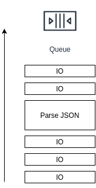

> [Part 1. Coding.](/p/writing-async-app-in-scala-part-1-coding) \
> [Part 2. Exception Handling.](/p/writing-async-app-in-scala-part-2-exception-handling) \
> Part 3. Threading Model. \
> [Part 4. Rewrite Blocking App.](/p/writing-async-app-in-scala-part-4-rewrite-blocking-app) \
> Part 5. What's next?

In previous parts we avoided the question of which `ExecutionContext` we should use. Finally, we got to it! In this part I'm going to cover a lot of different topics around multi-threading. Let's start right away!

## How many threads should we use?

One interesting thing that async programming provides to us is an ability to use a small number of threads, close to the number of [available CPUs](https://docs.oracle.com/javase/7/docs/api/java/lang/Runtime.html#availableProcessors()). Why is it cool?

1. Smaller memory consumption: [by default](https://docs.oracle.com/en/java/javase/14/docs/specs/man/java.html) thread allocates 1 megabyte of memory for stack; minimum is different on different platforms, for example, on 64-bit Linux openjdk14 it's 136K.
2. Better resilience as there is no struggle for CPU resources. If you have more, it's possible that more than CPU number threads will awake at the same time and will try to do something.
3. (the most significant one) It brings peace to a soul of a control freak :D

What kinds of operations do we need to perform in our application:
* HTTP or whatever server performs some [IO](https://en.wikipedia.org/wiki/Input/output) for incoming/outgoing requests.
* RPC/HTTP clients do some IO.
* Database driver does IO.
* And our application code orchestrates it all.

Now we need to decide how do we want to split all these operations among available CPUs.

NB: I left out one more kind of operations, namely - local disk IO (logging, file cache, etc.) I hope I'd be able to write a dedicated blog post about logging in async world.

### IO vs application code

What are the differences between the code of our application and other stuff? I mentioned IO not by accident. For example, what does an HTTP server?
* Listen for incoming connection.
* Reads some chunk of a request. This is an async part.
* Parses an HTTP request: it requires some CPU to split raw bytes into nice data object with protocol version, method, headers, etc.
* Passes control to an application: this is our part.
* Writes back a response, which is mostly async.

As you may see, mostly HTTP server waits for bytes to read or that bytes are written. Therefore, it needs very short time slots on the CPU. The same applies to all mostly IO code: HTTP client (which is essentially very similar to server), database drivers, etc.

An application, on the other hand, may do slightly more (just as an example):
* Parse request body as JSON.
* Convert JSON to some domain object.
* Convert domain object to some other object in order to serialize it as JSON and send via RPC.
* Parse JSON of RPC response, mix up with domain object.
* Prepare a query to the database.
* Parse response from database (convert to domain model or even parse JSON, stored in DB).
* Collect everything together, serialize to JSON and send back to a client.

So, an application orchestrates requests to multiple servers, does parsing and serialization (which are CPU-bound operations), converts one representation to another.

### Short introduction to ExecutionContext

[ExecutionContext](https://www.scala-lang.org/api/current/scala/concurrent/ExecutionContext.html) is a simple abstraction:
```scala
trait ExecutionContext {
  def execute(runnable: Runnable): Unit
  def reportFailure(cause: Throwable): Unit
}
```

Usually, there is a some kind of thread pool behind `ExecutionContext`: one of the [ExecutorService](https://docs.oracle.com/en/java/javase/14/docs/api/java.base/java/util/concurrent/Executors.html) provided by JDK (FixedThreadPool, ForkJoinPool, etc.)

Any thread pool consists of 2 parts: queue for incoming tasks and a pool of threads. In order to run `map`/`flatMap`/`onComplete` of a `Future`, we need to submit a task (Runnable) to an `ExecutorService`. Submit consists of 2 operations: [offer](https://docs.oracle.com/en/java/javase/14/docs/api/java.base/java/util/concurrent/BlockingQueue.html#offer(E)) to a BlockingQueue and subsequent [take](https://docs.oracle.com/en/java/javase/14/docs/api/java.base/java/util/concurrent/BlockingQueue.html#take()) from it.

### One pool to rule them all

There is a temptation to use a single thread pool for all operations. Having the predefined [global](https://docs.scala-lang.org/overviews/core/futures.html#the-global-execution-context) ExecutionContext in scala library strengthens this temptation. However, don't be weak. There is something to consider. When we have a single thread pool, then we have a may encounter this kind of problem:



This is a queue with different tasks in it. Mostly it has short IO tasks, but then a task appears that needs to parse some big JSON. And all short IO tasks will wait for this parsing to finish. If you use some highly optimized HTTP server like [netty](https://netty.io/) this is something that is likely to happen, because in netty all IO for each connection is performed in a single thread to avoid any synchronization.

On the other hand, if a thread pool is implemented properly (like in netty), the locality of data in a thread will enable faster execution. For example, when an HTTP server read a chunk of bytes, it sits in a CPU cache, and if parsing code will be executed right after a read operation, it will work with a cached data as opposed to working with a cold memory (for example, see latencies for accessing caches and memory for [i7 skylake](https://www.7-cpu.com/cpu/Skylake.html).)

I will continue this topic at the end.

## Blocking code

Obviously, in async applications we should avoid using blocking code. But what if our database doesn't have a working async driver? What if the only way to use it is a blocking JDBC?

It's very important to remember to not mix a non-blocking code with a blocking one. As I showed in a previous part, consequences may be very tragic for responsiveness and overall throughput.

What to do? Use a separate thread pool! What size to choose<strong>*</strong>? The number of maximum SQL connections you're willing to use from a single application instance. Is it safe? Let's try to find out!

The first approach to write a DAO:
```scala
implicit val blockingExecutionContext =
  ExecutionContext.fromExecutorService(Executors.newFixedThreadPool(50))

class MyDao(jdbcTemplate: JdbcTemplate)(implicit ec: ExecutionContext) {
  def get(id: String): Future[Option[RichDomainObject]] =
    Future(getBlocking(id))

  private def getBlocking(id: String): Option[RichDomainObject] =
    jdbcTemplate.queryForObject(
      "SELECT blob FROM table WHERE id = ?",
      Array(id),
      rs => parseJson(rs.getString(1))
    )

  private def parseJson(s: String): RichDomainObject = ???
}
```

Here we create a thread pool with 50 threads, and then we just submit a `Future` to this thread pool, and everything is done there. Good? Kind of. It's working unless... Do you see the part where we need to parse a JSON from a blob column in a database? This part may be problematic. Imagine, our service got a sudden spike, and we got a lot of requests in parallel. It's quite possible, that at the same time more than a CPU number threads will get a response from a database and will start to parse JSON in parallel. JSON parsing is a CPU-bound operation, so threads will fight for CPU resources which will cause elevated response times, etc. We don't want it. What to do?

Let's be a little bit smart about it:
```scala
class RobustDao(jdbcTemplate: JdbcTemplate, blockingEc: ExecutionContext, applicationEc: ExecutionContext) {
  def get(id: String): Future[Option[RichDomainObject]] = {
    Future(getBlocking(id))(blockingEc)
      .map(blob => blob.map(parseJson))(applicationEc)
  }

  private def getBlocking(id: String): Option[String] =
    jdbcTemplate.queryForObject(
      "SELECT blob FROM table WHERE id = ?",
      Array(id),
      rs => rs.getString(1) // no parsing, just simple data extraction
    )

  private def parseJson(s: String): RichDomainObject = ???
}
```

Here we split a query into 2 parts:
1. Execute query and extract the blob column. It should be very quick in terms of CPU. So multiple concurrent executions won't lead to a fight for CPU.
2. Parse JSON into a domain object. This part will be executed in another `ExecutionContext`, which should be limited to a number of threads less or equal to a number of CPUs.

By doing so we increase the resilience of our application to high traffic. Just to mention, that it's not a final solution, for peak traffic you still need to scale up your cluster, but this solution will give you time to do that, and servers won't die.

<strong>*</strong> There are [formulas](http://baddotrobot.com/blog/2013/06/01/optimum-number-of-threads/) to calculate feasible number of threads in a blocking application. I wouldn't worry unless you have about few dozens of threads doing only queries, without any heavy calculations.

## Thread Locals

If you don't use [ThreadLocal](https://docs.oracle.com/en/java/javase/14/docs/api/java.base/java/lang/ThreadLocal.html) just continue not using it and you may skip this chapter. For everyone else...

Side note: Here I'm talking about thread locals that are used as a context for the request. Other legitimate [usages](https://javapapers.com/core-java/threadlocal/) like providing thread safety for non thread-safe instances are fine.

In a blocking application it's a convenient way of the propagation of aspects that aren't always related to a business code. There are [some caveats](https://stackoverflow.com/questions/817856/when-and-how-should-i-use-a-threadlocal-variable), though. In async application it gets ugly(er):

* In async application one request is likely to be handled by multiple threads. At any point when execution moves into async mode (meaning, goes to wait for some event), you have to copy your thread locals and restore it again when the execution resumes. It could be a bit expensive.
* Such implicitness isn't the best pattern to use. It's error-prone and obscure (especially for newcomers).

It's much better to have some kind of a context object that you pass along with the request (you may do it as an implicit argument which is less implicit than thread local).

## Direct ExecutionContext

In guava there is a [directExecutor](https://guava.dev/releases/19.0/api/docs/com/google/common/util/concurrent/MoreExecutors.html#directExecutor()) which simply executes runnable immediately in the same thread. Same idea in Scala would look like:
```scala
implicit val directExecutionContext = ExecutionContext.fromExecutor(
  (runnable: Runnable) => runnable.run()
)
```

Do we really need it? By definition, it doesn't provide any concurrency. And still, I'd argue it's a very important piece of our async application. Let's understand -- why?

### Simple example

Let's consider this completely foobar-ish example.

```scala
def rpcCall: Future[String] = ???

rpcCall
  .map(_.split('_'))
  .filter(_.length < 4)
  .map {
    case Array(single) => single
    case Array(first, second@_) => first
    case Array(first@_, second, third@_) => third
    case _ => ""
  }
  .map(value => s"<p>$value</p>")
  .recoverFilter("<p>invalid</p>")
```

What I want to show here is that we don't always write an optimal code, sometimes we write something like this just because it's fairly simple and easy to read all in one place. But there's a micro-problem: each of these functions takes an implicit `ExecutionContext` and submits a task to a thread pool. Is it bad? Let's benchmark it!

### Benchmark!

The code of benchmark is [here](https://github.com/dkomanov/stuff/blob/master/src/com/komanov/future/jmh/FutureMapBenchmark.scala). We do a very simple benchmark:

```scala
var future = Future.successful(0)
for (_ <- 1 to 100) {
  future = future.map(v => v + 1)
}
require(Await.result(future, 10.seconds) == 100)
```

And we measure this piece of code with different execution contexts: [global](https://docs.scala-lang.org/overviews/core/futures.html#the-global-execution-context) which is backed by ForkJoinPool, single-threaded `ExecutionContext` which is backed by [Executors.newSingleThreadExecutor](https://docs.oracle.com/en/java/javase/14/docs/api/java.base/java/util/concurrent/Executors.html#newSingleThreadExecutor()) and direct `ExecutionContext`. The result table is below (units are micro-seconds):

```
Benchmark                            Mode  Cnt   Score    Error  Units
FutureMapBenchmark.direct            avgt    5   4.056 ±  0.163  us/op
FutureMapBenchmark.realGlobal        avgt    5  62.999 ± 17.757  us/op
FutureMapBenchmark.realSingleThread  avgt    5  18.046 ±  0.722  us/op
FutureMapBenchmark.smart             avgt    5   1.693 ±  0.100  us/op
```

As you may see, direct wins easily as it doesn't do any context switching, no queue operations, etc. `global` loses to a single threaded pretty significantly, because, yes, both have queue operations, but in case of single-threaded there are no context switches, everything is happening in a single thread.

But what is `smart`? It's a very neat optimization, here is an `Future[T]` extension method:

```scala
def smartMap[U](f: T => U)(implicit ec: ExecutionContext): Future[U] =
  if (future.isCompleted) {
    if (future.value.get.isSuccess)
      wrap(f(future.value.get.get))
    else
      future.asInstanceOf[Future[U]]
  } else {
    future.map(f)(ec)
  }
```

Inside `smartMap` we check whether `Future` is resolved or not. If it's resolved we can execute a mapping function right away, without submitting it to an `ExecutionContext`. As you may see from the benchmark, there is a cost of submitting task to an `ExecutionContext`. Here is what is happening on submit effectively (real code is slightly more complicated, you're welcome to explore it by yourself):

```scala
def map[U](f: T => U)(implicit ec: ExecutionContext): Future[U] = {
  val promise = Promise()
  if (isCompleted) // in real code this is an atomic operation + pattern matching
    // even if it's completed, callback is submitted to ExecutionContext
    ec.execute(() => {
      f(result)
    })
  else
    registerCallback(f)(ec)
  promise.future
}
```

And all this complexity could be avoided by using `smartMap`.

Of course, there is a reason, why the default behavior of a `Future` is like this. In general case such optimizations (direct executor and smartMap) could lead to a [starvation](https://docs.oracle.com/javase/tutorial/essential/concurrency/starvelive.html) if all operations on futures are too long. However, if we know the load profile of our application we can apply such optimizations for a pretty good benefit.

Regarding `smartMap`. I put it as an example, in my real code I don't use it, because we don't have that many possibly-redundant operations, and usage of non-standard extensions would lead to confusion as it would be kind of necessary then to avoid using standard ones, which complicates life much more than gain we get from it.

### How to use direct ExecutionContext

Usage of direct ExecutionContext brings some new considerations. Consider this example:

```scala
def rpcCall: Future[String] = ???
def daoCall(id: String): Future[Int] = ???
def extractId(idStr: String): Future[String] = ???
def convertDbValue(value: Int): Future[Int] = ???

import directExecutionContext

for {
  idStr <- rpcCall
  id <- extractId(idStr) // executed in RPC execution context
  valueFromDb <- daoCall(id)
  value <- convertDbValue(valueFromDb) // executed in DAO execution context
} yield value // executed in DAO execution context
```

With naive usage of `direct` we may encounter very much undesired consequences: execution will jump from one `ExecutionContext` to another. It's all under the assumption that all real async operations have their own execution contexts. If you use single shared `ExecutionContext` there is no such problem.

To tackle this problem, what we need to do is to ensure that in all places where we use non-application `ExecutionContext` we have to move `Future` back to application `ExecutionContext`:

```scala
class RpcClient(ownEc: ExecutionContext, appEc: ExecutionContext) {
  def call: Future[String] =
    Future("a")(ownEc)
      .map(identity)(appEc) // here we move back to an application execution context
}
```

By doing this trick the next transformation (submitted to `direct`) on a `Future` returned by `RpcClient` will be executed in an application `ExecutionContext`. If you do it everywhere you'll be able to utilize the superiority of a direct `ExecutionContext`.

As a result of using `directExecutionContext` we almost never have `implicit ec: ExecutionContext`, because in order to make sure that correct `ExecutionContext` will be used, we have to completely separate async resources from application code. So, `ExecutionContext` for the application code is used along with another `ExecutionContext` in a resource just as in an example above. And in all classes that do business logic of the application we can just import `directExecutionContext` and concentrate on the business-related code, not on the multi-threading aspect of the code.

### Neat side effect

It's known that stack trace is almost useless in async applications. Let's find out how badly via simple [demo](https://github.com/dkomanov/stuff/blob/master/src/com/komanov/future/examples/ExceptionDemo.scala):
```scala
def stackTrace(implicit ec: ExecutionContext): Any = {
  Await.result(
    Future.successful(1)
      .map(v => v + 1)
      .flatMap(v => Future.successful(v))
      .map { v =>
        new IllegalStateException().printStackTrace()
        v
      },
    10.seconds
  )
}

stackTrace(scala.concurrent.ExecutionContext.Implicits.global)
stackTrace(com.komanov.future.directExecutionContext)
```

For `global` there will stack trace like this:
```
java.lang.IllegalStateException
    at com.komanov.future.examples.ExceptionDemo$.$anonfun$stackTrace$3(ExceptionDemo.scala:14)
    at scala.runtime.java8.JFunction1$mcII$sp.apply(JFunction1$mcII$sp.java:23)
    at scala.util.Success.$anonfun$map$1(Try.scala:255)
    at scala.util.Success.map(Try.scala:213)
    at scala.concurrent.Future.$anonfun$map$1(Future.scala:292)
    at scala.concurrent.impl.Promise.liftedTree1$1(Promise.scala:33)
    at scala.concurrent.impl.Promise.$anonfun$transform$1(Promise.scala:33)
    at scala.concurrent.impl.CallbackRunnable.run(Promise.scala:64)
    at java.util.concurrent.ForkJoinTask$RunnableExecuteAction.exec(ForkJoinTask.java:1402)
    at java.util.concurrent.ForkJoinTask.doExec(ForkJoinTask.java:289)
    at java.util.concurrent.ForkJoinPool$WorkQueue.runTask(ForkJoinPool.java:1056)
    at java.util.concurrent.ForkJoinPool.runWorker(ForkJoinPool.java:1692)
    at java.util.concurrent.ForkJoinWorkerThread.run(ForkJoinWorkerThread.java:157)
```

And for `direct`:
```
java.lang.IllegalStateException
    at com.komanov.future.examples.ExceptionDemo$.$anonfun$stackTrace$3(ExceptionDemo.scala:14)
    at scala.runtime.java8.JFunction1$mcII$sp.apply(JFunction1$mcII$sp.java:23)
    at scala.util.Success.$anonfun$map$1(Try.scala:255)
    at scala.util.Success.map(Try.scala:213)
    at scala.concurrent.Future.$anonfun$map$1(Future.scala:292)
    at scala.concurrent.impl.Promise.liftedTree1$1(Promise.scala:33)
    at scala.concurrent.impl.Promise.$anonfun$transform$1(Promise.scala:33)
    at scala.concurrent.impl.CallbackRunnable.run(Promise.scala:64)
    at com.komanov.future.package$DirectExecutor.execute(package.scala:29)
    at scala.concurrent.impl.ExecutionContextImpl.execute(ExecutionContextImpl.scala:24)
    at scala.concurrent.impl.CallbackRunnable.executeWithValue(Promise.scala:72)
    at scala.concurrent.impl.Promise$DefaultPromise.dispatchOrAddCallback(Promise.scala:316)
    at scala.concurrent.impl.Promise$DefaultPromise.onComplete(Promise.scala:307)
    at scala.concurrent.impl.Promise.transform(Promise.scala:33)
    at scala.concurrent.impl.Promise.transform$(Promise.scala:31)
    at scala.concurrent.impl.Promise$DefaultPromise.transform(Promise.scala:187)
    at scala.concurrent.Future.map(Future.scala:292)
    at scala.concurrent.Future.map$(Future.scala:292)
    at scala.concurrent.impl.Promise$DefaultPromise.map(Promise.scala:187)
    at com.komanov.future.examples.ExceptionDemo$.stackTrace(ExceptionDemo.scala:13)
    at com.komanov.future.examples.ExceptionDemo$.delayedEndpoint$com$komanov$future$examples$ExceptionDemo$1(ExceptionDemo.scala:22)
    at com.komanov.future.examples.ExceptionDemo$delayedInit$body.apply(ExceptionDemo.scala:6)
    at scala.Function0.apply$mcV$sp(Function0.scala:39)
    at scala.Function0.apply$mcV$sp$(Function0.scala:39)
    at scala.runtime.AbstractFunction0.apply$mcV$sp(AbstractFunction0.scala:17)
    at scala.App.$anonfun$main$1$adapted(App.scala:80)
    at scala.collection.immutable.List.foreach(List.scala:392)
    at scala.App.main(App.scala:80)
    at scala.App.main$(App.scala:78)
    at com.komanov.future.examples.ExceptionDemo$.main(ExceptionDemo.scala:6)
    at com.komanov.future.examples.ExceptionDemo.main(ExceptionDemo.scala)
```

As you may see, it has much more information. This example has only 2 nesting levels, but it's clear from this example, that with `directExecutionContext` we get the stack trace from the last async operation, which is not as good as in blocking app, but slightly better than non-direct.

## The Final Glance

So, at the end, how many threads are we going to use? And how many `ExecutionContext`s? Options vary, but there are 2 opposite cases: one thread pool/ExecutionContext for everything and multiple pools, possibly one per each IO entity; and all kinds of permutations in the middle. Let's explore both opposites.

### Single shared thread pool

A single thread pool for the application code and all IO code is possible. For achieving that you need use only non-blocking libraries with an ability to specify (override) a thread pool. In this case everything is pretty simple, you have only 2 `ExecutionContext`s: direct and an `ExecutionContext` backed by the single thread pool for async stuff.

This approach is the simplest in terms of code. No need to think where to submit task: for all async stuff use the real thread pool, for everything else use `directExecutionContext`. But, as I stated before, beware of having long tasks that take too much time on the CPU to prevent elevated response time for requests which are ready to be sent back, but waiting in a queue.

### Pool per resource

As an extreme case we may assign a dedicated thread pool for each entity like RPC client, HTTP client or database connection pool. Pros would be separation of concerns, absence of single point of failure, no interference between resources. Cons are too many threads to use, which may cause some fighting for resources. But still, if you know the distribution of traffic well and know that it's unlikely for different resources to be used at the same time, it could be a viable solution as well.

I wouldn't recommend this approach, as I really don't like to use more threads than it's necessary. If possible, group resources by usage patterns and share threads among them.

### QoS

Another thing to consider is different requirements for different resources. For example, you may have an RPC client with 2 methods. One you call on a user-facing request, another you call in background, for example, to update some in-memory cache. And if a background method can transfer more data, parses bigger objects, you may consider to move it to a separate thread pool to not harm online user-facing requests making it suddenly slower.

Same applies to more important resources vs less important resources. There might be a consideration that more resources should be allocated for the most important transaction. Sometimes even on per user basis to provide different [SLA](https://en.wikipedia.org/wiki/Service-level_agreement).

### Personal example

In my real application I have this separation:
* Thread pool for the [netty](https://netty.io/) HTTP server and all netty-based HTTP clients.
* Thread pool for application code in which most of the business logic is happening along with parsing and serialization of JSON/protobuf/whatever.
* Thread pool for blocking JDBC queries.
* Single-threaded ScheduledExecutorService for timers and periodic background tasks, including slow HTTP client.

The proportion between the netty pool and the application pool is totally based on a planned load on a service. But even a single-threaded pool in netty may handle a lot of traffic.

## Conclusion

I want to leave you with few points, just to recap:
* Try to minimize a number of threads. Your application's resilience depends on it.
* Don't use Await. Never. If you have a `Future` just propagate it further.
* Isolate blocking code. Use an async alternative if possible.
* Use direct `ExecutionContext` in your application code.

All code is available on [GitHub](https://github.com/dkomanov/stuff/tree/master/src/com/komanov/future). Originally posted on [Medium](https://medium.com/@dkomanov/writing-async-app-in-scala-part-3-threading-model-ef9e9033bd33). [Image](https://pixabay.com/photos/craftsman-loom-craftsmanship-hands-1839920/) by [Pexels](https://pixabay.com/users/Pexels-2286921/?utm_source=link-attribution&utm_medium=referral&utm_campaign=image&utm_content=1839920) from [Pixabay](https://pixabay.com/?utm_source=link-attribution&utm_medium=referral&utm_campaign=image&utm_content=1839920).
