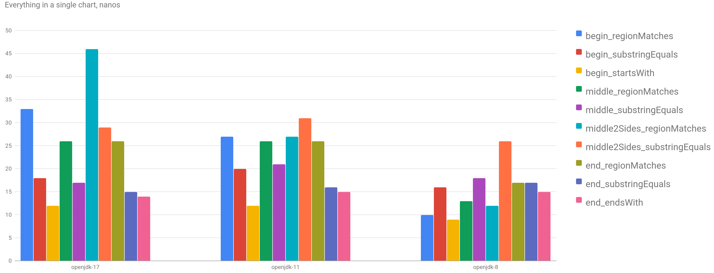

Yet another post about performance and microbenchmarks. [Beware](http://wiki.jvmlangsummit.com/images/1/1d/PerformanceAnxiety2010.pdf) of the results.

There is a method in [String](https://docs.oracle.com/en/java/javase/17/docs/api/java.base/java/lang/String.html) class, called [regionMatches](https://docs.oracle.com/en/java/javase/17/docs/api/java.base/java/lang/String.html#regionMatches(int,java.lang.String,int,int)). Basically, it tests if the string has another string as a substring at the specific place:

```java
"one_two_three".regionMatches(4, "two", 0, 3) // true
```

By some reason I wondered about its performance comparing to other methods: startsWith and endsWith. And _just for fun_ adding another comparison with the functional equivalent:

```java
"one_two_three".substring(4, 3).equals("two") // true
```

Obviously, the `regionMatches` should outperform the latter, just because of the substring (which has extra memory allocation). I was actually shocked by the results:

```
regionMatches             avgt    3  26.565 ±   1.306  ns/op
substringEquals           avgt    3  15.663 ±  11.616  ns/op
```

WHAT?! This can't be right! However, no matter how many times or how long I ran this benchmark, results were more or less the same: substring+equals outperformed regionMatches... Then I wrote a little bit more comprehensive test (however, it has only one input data -- a string of 51 characters).

## Benchmarks

Ok, now we need to go deeper, so let me show all the different benchmarks I did.

Test data: a search string `uri` of 51 characters, [needles](https://www.languagecouncils.sg/goodenglish/resources/idioms/a-needle-in-a-haystack) at the beginning, in the middle and at the end of the string.

```scala
val uri = "/site/section/blog/2022-04-17/the-title-of-the-post"
val begin = "/site/section/blog/2"
val middle = "/blog/2022-04-17/the"
val end = "he-title-of-the-post"
```

Testing at the beginning of the string:
```scala
@Benchmark
def begin_startsWith(): Boolean =
  uri.startsWith(begin)

@Benchmark
def begin_regionMatches(): Boolean =
  uri.regionMatches(0, begin, 0, begin.length)

@Benchmark
def begin_substringEquals(): Boolean =
  uri.substring(0, begin.length) == begin
```

At the end:
```scala
@Benchmark
def end_endsWith(): Boolean =
  uri.endsWith(end)

@Benchmark
def end_regionMatches(): Boolean =
  uri.regionMatches(endIndex, end, 0, end.length)

@Benchmark
def end_substringEquals(): Boolean =
  uri.substring(endIndex) == end
```

In the middle I did 2 tests, one to find exact substring (`val middle = "/blog/2022-04-17/the"`), another is to find part of the substring (`val middle2Sides = s"-$middle-"`). The idea of the second case is to make 2 substrings, not one.

```scala
@Benchmark
def middle_regionMatches(): Boolean =
  uri.regionMatches(middleIndex, middle, 0, middle.length)

@Benchmark
def middle_substringEquals(): Boolean =
  uri.substring(middleIndex, middleIndex + middle.length) == middle

@Benchmark
def middle2Sides_regionMatches(): Boolean =
  uri.regionMatches(middleIndex, middle2Sides, 1, middle2Sides.length - 2)

@Benchmark
def middle2Sides_substringEquals(): Boolean =
  uri.substring(middleIndex, middleIndex + middle.length) ==
    middle2Sides.substring(1, middle2Sides.length - 1)
```

## JVM

After a while I decided to run benchmarks against different JVMs, because I couldn't explain what's happening there (as I showed in the beginning of the post, substring+equals won!). And I ran all these benchmarks on 3 JVMs: openjdk-8, openjdk-11 and openjdk-17.



Interesting, right? Looks like JDK8 is faster or the same for all cases, and then performance deteriorating, and in openjdk-17 `regionMatches` significantly slower than `substring+equals`. I don't know how to explain it apart from some internal JVM optimizations for `equals` method that aren't applied for `regionMatches`.

I did a test for smaller needle, and it shows that there is a some sweet spot (length), when performance of `regionMatches` becomes better than `substring+equals`, but it's in low single digits (on my computer).

My guess, is that this loop in `regionMatches` isn't optimized:
```java
while (len-- > 0) {
    if (tv[toffset++] != ov[ooffset++]) {
        return false;
    }
}
```

`equals` method uses internal method [StringLatin1.equals](https://github.com/openjdk/jdk/blob/jdk-17+35/src/java.base/share/classes/java/lang/StringLatin1.java#L94), which also does the loop, but maybe length check before removes bound checks:
```java
@IntrinsicCandidate
public static boolean equals(byte[] value, byte[] other) {
    if (value.length == other.length) {
        for (int i = 0; i < value.length; i++) {
            if (value[i] != other[i]) {
                return false;
            }
        }
        return true;
    }
    return false;
}
```

## Conclusion

It seems like a bug in JVM, `regionMatches` isn't supposed to behave this way. And sometimes it's worth benchmarking something basic: our assumptions aren't always correct. Also, I'd like to mention a couple of blog posts about benchmarking around this area: [one](https://medium.com/javarevisited/micro-optimizations-in-java-string-equalsignorecase-ea25dfb03f95) and [two](https://thedeveloperblog.com/java/regionmatches-java) -- sadly, all were done for JDK8 and didn't reveal anything strange.


Play with charts [here](/charts/region-matches). Source code is on [GitHub](https://github.com/dkomanov/stuff/blob/0bb004e663ac48453d9505c85f622d20ef067b87/src/com/komanov/str/jmh/RegionMatchesBenchmarks.scala). Originally posted on [Medium](https://medium.com/@dkomanov/benchmarking-string-regionmatches-a08a6bc17dbc). [Cover image](https://pixabay.com/illustrations/stopwatch-time-treadmill-race-259303/) by [jarmoluk](https://pixabay.com/users/jarmoluk-143740/) from [Pixabay](https://pixabay.com/).
