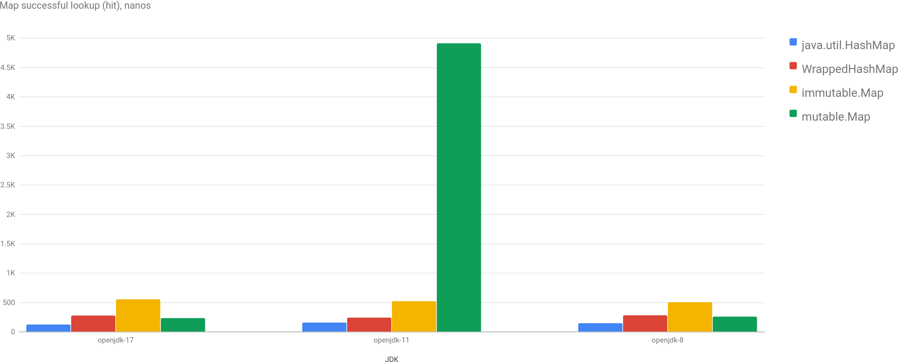
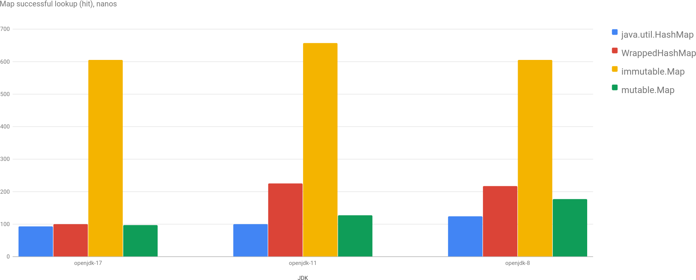
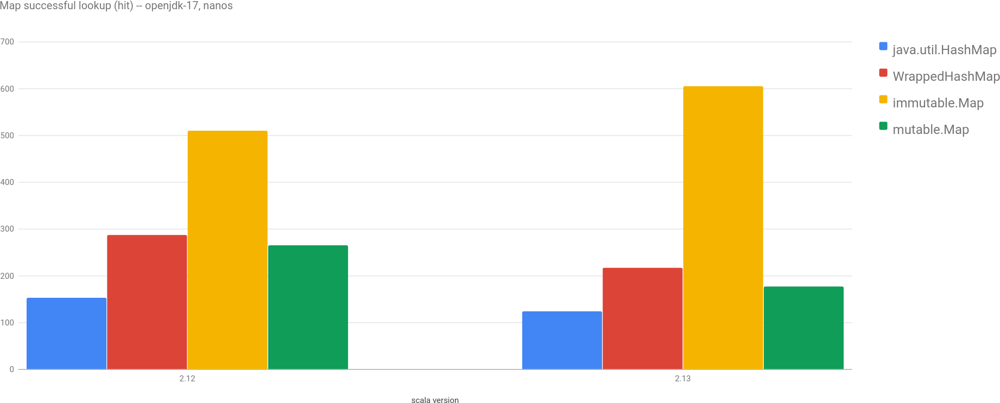

Yet another post about performance and microbenchmarks. [Beware](http://wiki.jvmlangsummit.com/images/1/1d/PerformanceAnxiety2010.pdf) of the results.

I was wondering about performance of [Scala](https://docs.scala-lang.org/overviews/collections/overview.html) [collections](https://docs.scala-lang.org/overviews/collections-2.13/overview.html) and especially with comparison to its Java counterparts. And few days ago, working on my day-to-day work stuff I decided to indulge myself and benchmark it (finally!). I worked on some simple but quite big cache (up to 1 million keys), so I had to decide, which collection to use :) BTW, there aren't a lot of good benchmarks done in this area ([this one](https://www.lihaoyi.com/post/BenchmarkingScalaCollections.html) is big and good, but old and doesn't make comparisons with Java). Anyway, let's go straight to benchmarks!

## Benchmark case

I want to benchmark 2 cases: `Set[UUID]` and `Map[UUID, V]`, as I was going to need them both. [UUID](https://cr.openjdk.java.net/~iris/se/17/latestSpec/api/java.base/java/util/UUID.html) is used as key, which is slightly less boring than String or Int :) (it's slightly faster than String's equas/hashCode and slightly more complicated than Int).

What am I going to benchmark? For `Set[UUID]`: [java.util.HashSet](https://cr.openjdk.java.net/~iris/se/17/latestSpec//api/java.base/java/util/HashSet.html), [Wrapper](https://github.com/scala/scala/blob/2.12.x/src/library/scala/collection/convert/JavaCollectionWrappers.scala#L183) for java.util.Set, [immutable.Set](https://github.com/scala/scala/blob/2.12.x/src/library/scala/collection/immutable/Set.scala) and [mutable.Set](https://github.com/scala/scala/blob/2.12.x/src/library/scala/collection/mutable/Set.scala). And the same for Map.

## Benchmarks

So, I wrote all the benchmarks, ran and...

I was disappointed to say the least: scala collection were at least 2 times slower... Wow. (don't mind huge peak for openjdk-11, I guess it's some background process or something)

Then I remembered, that I still used Scala 2.12 in my benchmarking project, I was postponing the upgrade to 2.13 for some time and I guess the time has come. [Migration](https://github.com/dkomanov/stuff/commit/817f228385e3c79e9b6ecf13bf25bb5daba95d82) wasn't painful as there isn't a lot of code. Running again and...

Now it's interesting... I would even say unexpected.

Performance of `mutable.Map` is now more or less the same with `java.util.HashMap`. But performance of `immutable.Map` is even worse (many times worse). Wow again.

Let's compare now between different scala versions for openjdk-17:

Yes, we clearly see that mutable implementation is improved significantly and immutable implementation degraded.

## Conclusion

From these benchmarks we can see that performance of JDK implementation of HashMap (HashSet's implementation just [uses HashMap](https://github.com/openjdk/jdk/blob/jdk-17%2B35/src/java.base/share/classes/java/util/HashSet.java#L107) internally) was improved a little bit since openjdk-8.

I don't know why, but performance of immutable version of Set/Map in Scala degraded, which is a bit counter-intuitive, as immutable collection can be optimized better than mutable... But this is how it's now. If you really need performance for your lookups - use mutable versions (either Java or Scala)...

Play with charts [here](/charts/set-map-java-vs-scala). Source code is on [GitHub](https://github.com/dkomanov/stuff/blob/817f228385e3c79e9b6ecf13bf25bb5daba95d82/src/com/komanov/collection/jmh/SetMapJavaVsScalaBenchmarks.scala). Originally posted on [Medium](https://medium.com/@dkomanov/). [Cover image](https://pixabay.com/photos/dictionary-words-abc-letters-390027/) by [pdpics](https://pixabay.com/users/pdpics-44804/) from [Pixabay](https://pixabay.com/).
