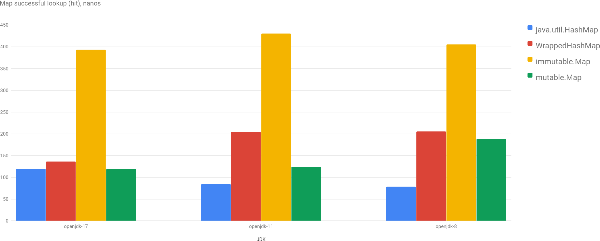
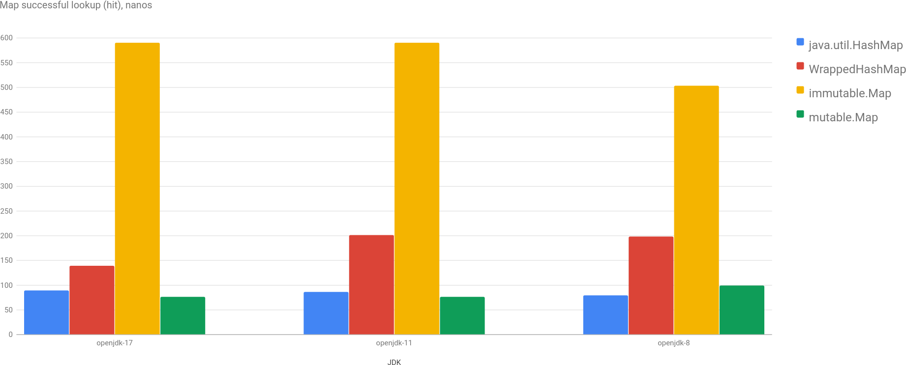
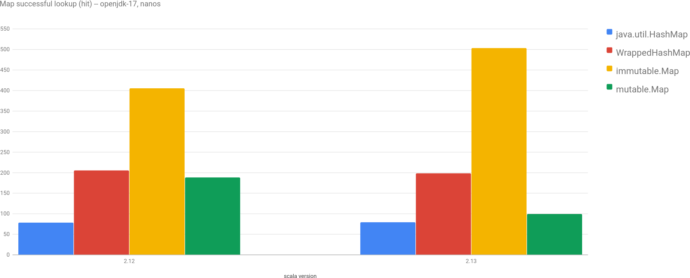

Yet another post about performance and microbenchmarks. [Beware](http://wiki.jvmlangsummit.com/images/1/1d/PerformanceAnxiety2010.pdf) of the results.

I was wondering about performance of [Scala](https://docs.scala-lang.org/overviews/collections/overview.html) [collections](https://docs.scala-lang.org/overviews/collections-2.13/overview.html) and especially with comparison to its Java counterparts. And few days ago, working on my day-to-day work stuff I decided to indulge myself and benchmark it (finally!). I worked on some simple but quite big cache (up to 1 million keys), so I had to decide, which collection to use :) BTW, there aren't a lot of good benchmarks done in this area ([this one](https://www.lihaoyi.com/post/BenchmarkingScalaCollections.html) is big and good, but old and doesn't make comparisons with Java). Anyway, let's go straight to benchmarks!

## Benchmark Case

I want to benchmark 2 cases: `Map[UUID, V]` and `Set[UUID]`, as I was going to need them both. [UUID](https://cr.openjdk.java.net/~iris/se/17/latestSpec/api/java.base/java/util/UUID.html) is used as key, which is slightly less boring than String or Int :) (it's slightly faster than String's equals/hashCode and slightly more complicated than Int). Because it's a cache, I'm less concerned about how much time it takes to build a Map, and more about how much it takes to perform a lookup.

What am I going to benchmark? For `Map[UUID, V]`: [java.util.HashMap](https://cr.openjdk.java.net/~iris/se/17/latestSpec//api/java.base/java/util/HashMap.html), [Wrapper](https://github.com/scala/scala/blob/2.12.x/src/library/scala/collection/convert/Wrappers.scala#L317) for java.util.Map, [immutable.Map](https://github.com/scala/scala/blob/2.12.x/src/library/scala/collection/immutable/Map.scala) and [mutable.Map](https://github.com/scala/scala/blob/2.12.x/src/library/scala/collection/mutable/Map.scala). And the same for Set.

A single benchmark consists of 10 lookups, so when you see 100 nanoseconds, it's on average 10 nanoseconds per lookup.

## Benchmarks

So, I wrote all the benchmarks, ran and...

I was disappointed to say the least: Scala collections were significantly slower... Wow.

Then I remembered, that I still used Scala 2.12 in my benchmarking project, I was postponing the upgrade to [2.13](https://github.com/scala/scala/releases/v2.13.0) for some time and I guess the time has come. [Migration](https://github.com/dkomanov/stuff/commit/21fd664d8506feef443a8c66e84ccec23ffeb3ac) wasn't painful as there isn't a lot of code. Running again and...

Now it's interesting... I would even say unexpected.

Performance of `mutable.Map` is now more or less the same as `java.util.HashMap` (depending on the size of Map, for smaller maps it's even faster!). But performance of `immutable.Map` is even worse. Wow again.

Let's compare now between different Scala versions for openjdk-17:

Yes, we clearly see that mutable implementation is improved significantly and immutable implementation degraded.

## Conclusion

From these benchmarks we can see that performance of JDK implementation of HashMap (HashSet's implementation just [uses HashMap](https://github.com/openjdk/jdk/blob/jdk-17%2B35/src/java.base/share/classes/java/util/HashSet.java#L107) internally) was degraded a little bit since openjdk-8 (strange).

Wrapped version performance improved from jdk-8 to jdk-17, maybe JVM optimizes more aggressively in the latest versions.

I don't know why, but performance of immutable version of Map/Set in Scala degraded, which is a bit counter-intuitive, as immutable collection can be optimized better than mutable... But this is how it's now. If you really need performance for your lookups - use mutable versions (either Java or Scala)...

P.S. My initial benchmarks had some unpredictable spikes (10x) for Scala collections from time to time (like 500 nanos for 100K elements and then 5000 nanos for 10K elements, which doesn't make much sense). Those spikes were "consistent" in a way, than on each run (which takes ~45 minutes) there were few spikes for different JDK, different sizes, different Scala collections. I decided to remove possibility of strange behavior of Scala collections by [replacing it](https://github.com/dkomanov/stuff/commit/acae4c45f439c454d2a3bd247928a56747dd7813) with vanilla Java code which actually helped (sic!) Don't know what to make of it, except for "I trust Java more" :)

Play with charts [here](/charts/set-map-java-vs-scala). Source code is on [GitHub](https://github.com/dkomanov/stuff/blob/4be6934c27626678028fa9aa3c5ab508ac694780/src/com/komanov/collection/jmh/SetMapJavaVsScalaBenchmarks.scala). Originally posted on [Medium](https://dkomanov.medium.com/map-performance-java-vs-scala-72fec18db020). [Cover image](https://pixabay.com/photos/dictionary-words-abc-letters-390027/) by [pdpics](https://pixabay.com/users/pdpics-44804/) from [Pixabay](https://pixabay.com/).
