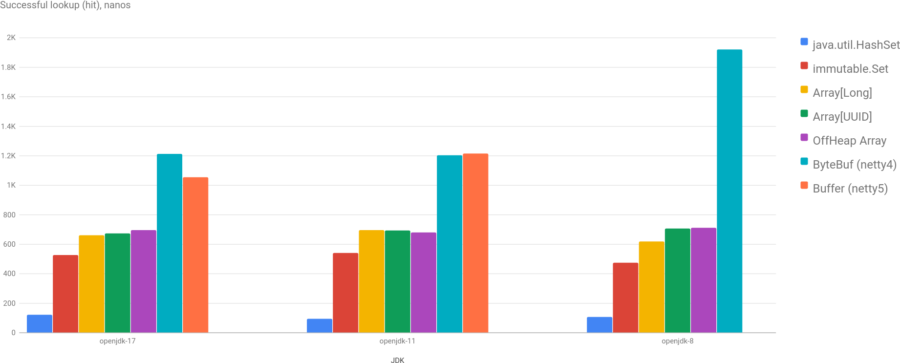
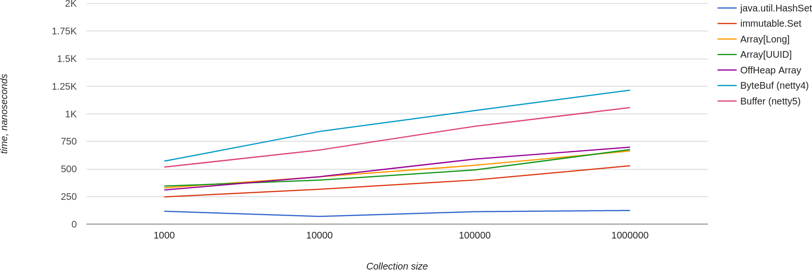
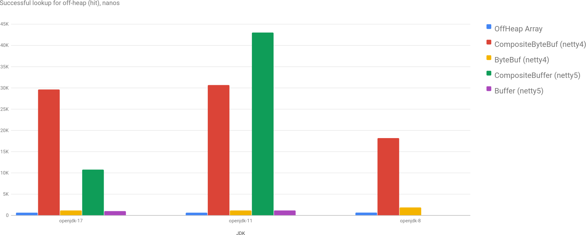

This post is not about a [Magical Solution](https://en.wikipedia.org/wiki/No_Silver_Bullet) that I found or some performances issues in [JDK](/p/benchmarking-string-regionmatches/) or in [Scala](/p/map-performance-java-vs-scala/). Here I want to describe my findings around a particular aspect of an application that I write. I hope you'll find something useful in this post, but don't expect any recipes.

A simplified use case in an application: on startup an application downloads a cache and then periodically updates it. The simplest example of a cache is a Set of [UUIDs](https://cr.openjdk.java.net/~iris/se/17/latestSpec/api/java.base/java/util/UUID.html). First, I thought about optimizing it via using different implementations of Set, you may check out my [post](/p/map-performance-java-vs-scala) about it (spoiler alert: `java.util.HashSet` is very good comparing to `scala.collection.immutable.Set`).

What to optimize next?

## Memory

The memory layout for `UUID` is simple: an object itself + 16 bytes (2 `long` fields). Object size on 64-bit architecture is 16 bytes: 12 bytes header + 4 bytes for alignment (according to [jol](https://openjdk.org/projects/code-tools/jol/)). So, every `UUID` object occupies 32 bytes in heap.

The layout for `HashSet` is more complicated, but in essence it's a wrapper for an array of `Node` class which has a reference to a key object. Roughly, it's something like x4 of the payload. If you have a million of such `UUIDs` it could be a concern. Or maybe not - who cares, we are in JVM, right? :)

Until [Project Valhalla](https://openjdk.org/projects/valhalla/) is not done, especially [JEP-401](https://openjdk.org/jeps/401) part of it, if we want to make memory more manageable, we need to do tricks.

The only trick in JVM is to use arrays, as an array is always contiguous in memory. Meaning, that if we will create an array of `long` of 2x size, then we will get enough memory to store an array of `UUID`. How does it help us? Well, instead of using `HashSet` we could sort an array of `UUID` and then use [binary search](https://cr.openjdk.java.net/~iris/se/17/latestSpec/api/java.base/java/util/Arrays.html#binarySearch(T%5B%5D,T,java.util.Comparator)) to determine if an array contains a `UUID`.

Simply put:
```java
UUID[] array = ...;
Arrays.sort(array);

public boolean contains(UUID key) {
  int found = Arrays.binarySearch(array, key);
  return found >= 0 && found < array.length;
}
```

Of course, `UUID[]` doesn't do much for us, a it still has 2x overhead of `UUID` object.

```java
int size = array.length;
long[] bits = new long[size * 2];
int index = 0;
array.forEach(uuid -> {
  bits[index++] = uuid.getMostSignificantBits();
  bits[index++] = uuid.getLeastSignificantBits();
});

// Here we need to borrow implementation from Arrays.binarySearch class.
public contains(UUID key) {
  int low = 0;
  int high = size - 1;

  while (low <= high) {
      int mid = (low + high) >>> 1;

      int current = 2 * mid;
      long mostBits = bits[current];

      if (mostBits < key.getMostSignificantBits())
          low = mid + 1;
      else if (mostBits > key.getMostSignificantBits())
          high = mid - 1;
      else {
          long leastBits = bits[current + 1];
          if (leastBits < key.getLeastSignificantBits())
              low = mid + 1;
          else if (leastBits > key.getLeastSignificantBits())
              high = mid - 1;
          else
              return true;
      }
  }
  return false;
}
```

In this solution we use almost exactly bytes in heap as we need (with only small array overhead).

## Going Off-Heap

Why [off-heap](https://github.com/openjdk/jdk/blob/master/src/java.base/share/classes/jdk/internal/misc/Unsafe.java#L621)? To say the truth - just for fun. I wouldn't put anything of this sort in production without an [actual](https://blogs.oracle.com/javamagazine/post/the-unsafe-class-unsafe-at-any-speed) necessity. However, why not to investigate this possibility as well from the performance perspective?

To fetch the cache I use an HTTP client based on [netty](https://netty.io/). In netty you may use [off-heap](https://github.com/openjdk/jdk/blob/master/src/java.base/share/classes/jdk/internal/misc/Unsafe.java#L621) memory for internal buffers etc. Which means that we can even obtain a cache with zero-copy!

Basically, instead of having `long[]` we need to allocate memory directly via Unsafe or via netty's API: [ByteBuf](https://netty.io/4.1/api/io/netty/buffer/ByteBuf.html) and [Allocator](https://netty.io/4.1/api/io/netty/buffer/PooledByteBufAllocator.html). All the code you may find [here](https://github.com/dkomanov/stuff/tree/16685505efad45555f0f048601c049b028835fe0/src/com/komanov/offheap).

What is zero-copy for netty? Basically, from netty you get response body in a series of `ByteBuf` instances that contain references to off-heap allocated memory with the chunk of the data. What you can do is to create a `CompositeByteBuf` and add all chunks to this composite buffer (if cache-server responds with already sorted, prepared data), then you don't need to copy those chunks and just reuse it.

## Benchmarks!

And now it's time to benchmark all the proposed solutions and to find out, what's best in terms of performance!

Disclaimer: [beware](http://wiki.jvmlangsummit.com/images/1/1d/PerformanceAnxiety2010.pdf) of the micro-benchmark results.

At the end I decided to include benchmarks for `java.util.Set` and `scala.collection.immutable.Set` as a reference and a kind of baseline. Then we have 2 implementations based on Java Array: array of `UUID` (just for the reference) and array of `long` (as a memory optimization). And then we have benchmarks for off-heap array implementation based on `Unsafe` class, `ByteBuf` implementation from netty v4 (`4.1.79.Final`) and `Buffer` implementation from netty v5 alpha version (`5.0.0.Alpha4`).

### Lookup performance in 3 JDKs

Here is a successful lookup (hit, contains returns true) performance in a collection of 1 million `UUIDs`. As you may see, `HashSet` is a clear leader, but this is not a [surprise](/p/map-performance-java-vs-scala/). Scala's `Set` performance is very close to binary search. Performance of off-heap array is very close to on-heap implementations, `long[]` is slightly better.



### Lookup performance for different Set size

Also, nothing unexpected here. Performance of `HashSet` doesn't depend on the collection size, performance of all other implementations degrades [logarithmically](https://en.wikipedia.org/wiki/Binary_search_algorithm).



### Off-Heap Performance

I excluded benchmarks of `CompositeByteBuf` and `CompositeBuffer`, because, as you may see, its performance is awful. Actually, it's not a surprise if to think about. The way I composed it in test - I split all data in chunks of 4000 bytes and added it to a composite buffer to simulate packets in the real network. For each lookup by index `CompositeByteBuf` should iterate over all buffers to find the relevant chunk... So, zero-copy has its huge cost :)



## Conclusion

It was a fun exercise for me. There is always a trade-off between memory and CPU usage, and this benchmark shows it well. I guess it's possible to build something fine-tuned tailored to `UUID`, but I'd prefer to wait for the [Valhalla](https://openjdk.org/projects/valhalla/) :)

The overhead of `ByteBuf` comparing to direct use of `Unsafe` is surprising. Though, it improved since jdk8, but still it's like one third slower. Custom binary search over array of `long` does slightly better, which is actually very cool to see.

I'd say if memory is not an important concern for you, there is no need to replace `HashSet` with `long[]`. 4x in memory usage compensate well with 6x performance. And with Valhalla Project memory usage eventually will go down as well. At least one might hope.


Play with charts [here](/charts/offheap-array). Source code is on [GitHub](https://github.com/dkomanov/stuff/blob/16685505efad45555f0f048601c049b028835fe0/src/com/komanov/offheap/jmh/Benchmarks.scala). Originally posted on [Medium](https://dkomanov.medium.com/replacing-hashset-with-sorted-array-and-binary-search-in-java-4a3b8023f0b). [Cover image](https://pixabay.com/illustrations/binary-zero-one-digital-blue-797274/) by [geralt](https://pixabay.com/users/geralt-9301/) from [Pixabay](https://pixabay.com/).
