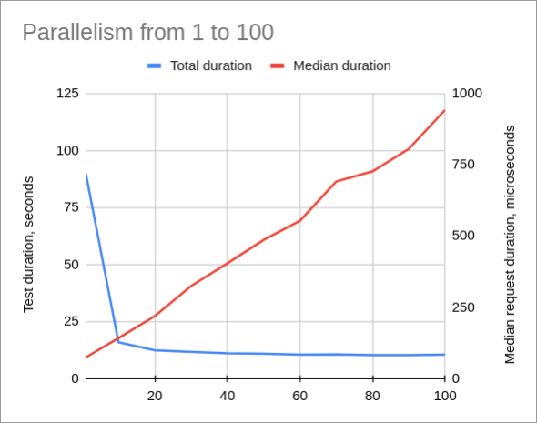
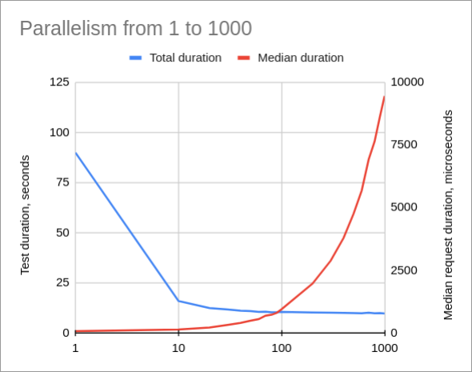
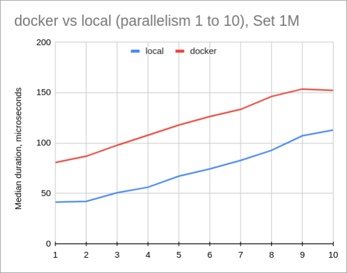

After my [post](/p/replacing-hashset-with-sorted-array-and-binary-search-in-java) about making off-heap Set-like data structure, my friend threw an idea at me: why not to go all the way, and use not just off-heap, but off-process? Why not to try to use [Redis](https://redis.io/) as a side-car and have caches there?

Indeed, why not to try?

I must say, that I knew in advance, that it's impossible for this solution to be faster than in-process cache, but it was still interesting, how slower it would be. And here we are, benchmarking [Redis Set](https://redis.io/docs/data-types/#sets).

## What are we testing?

My use case is simple - I have a large in-memory set of [UUID](https://cr.openjdk.java.net/~iris/se/17/latestSpec/api/java.base/java/util/UUID.html), around 1 million keys. For the benchmark sake I created 3 sets in Redis: 100K, 1M and 10M elements. Allegedly, the size of the Set shouldn't affect performance.

I went the simplest path by running Redis in a [docker container](https://hub.docker.com/_/redis):
```bash
docker run --name my-redis -p 6379:6379 redis:7.0-alpine
```

Next step is to generate data. I wanted to do it in bash, but `uuidgen` takes few milliseconds and to generate even 100K UUIDs takes to much time. Spawning a process is an expensive operation. A small script in Java to generate 100K UUIDs take less than a second.

Then I wrote a simple [script](https://github.com/dkomanov/stuff/blob/master/src/com/komanov/redis/bin/DataFiller.scala) to fill Redis with data. I use [Lettuce](https://lettuce.io/) -- a Java client for Redis. For that I need to provide a codec for the library to know how to encode/decode keys and values. [Codec](https://github.com/dkomanov/stuff/blob/master/src/com/komanov/redis/StringUuidCodec.scala) for UUID is pretty simple, I encode it as 16 bytes:

```scala
override def encodeValue(value: UUID): ByteBuffer = {
  val bb = ByteBuffer.allocate(16)
  bb.putLong(value.getMostSignificantBits)
  bb.putLong(value.getLeastSignificantBits)
  bb.rewind()
  bb
}
```

## Benchmark

For benchmarking I use [async API](https://github.com/lettuce-io/lettuce-core/wiki/Asynchronous-API) to deal as less as possible with multiple threads. Because Redis is single-threaded, it's [advised](https://github.com/lettuce-io/lettuce-core/wiki/Connection-Pooling) to use a single connection, which I did.

The [benchmark code](https://github.com/dkomanov/stuff/blob/master/src/com/komanov/redis/perf/PerfTester.java) is a little bit complicated. I test for different parallelism -- amount of concurrent requests to Redis, calculate duration by myself (it's not easy to utilize JMH for such use case without using blocking API).

I don't think my benchmark is very clever, for simplicity I use [LinkedBlockingDeque](https://docs.oracle.com/javase/7/docs/api/java/util/concurrent/LinkedBlockingDeque.html) in a main thread, and I use `remove` method, which is `O(N)` as it iterates over entire deque. However, I don't think it affects benchmark, request duration doesn't include it anyway.

## Results

All results available in [Google Sheets](https://docs.google.com/spreadsheets/d/1D5fhP-rxuxamOl58cGk7yLiLiViZnxWcE71klp6JC3I). As I mentioned, the performance doesn't really depend on a set size. From now on I'm going to use graphs and numbers for the benchmark of a set with 1M keys.

Here is a graph of a median request duration for different parallelism (from 1 to 100, step 10) and total test duration:



Minimal median duration is 74 microseconds (vs 100 nanoseconds for lookup in [HashSet](https://cr.openjdk.java.net/~iris/se/17/latestSpec/api/java.base/java/util/HashSet.html)), the fastest requests was 47 microseconds. The slowest was 19 millis, but it was a single request, other slowest requests were under 7 millis (which is still a lot). But keep in mind that Redis was under 100% utilization in this benchmark, it's unlikely to load Redis as much if Redis is a side-car... nevermind :)

The median increases with the parallelism (which makes sense). However, single-threaded parallelism doesn't utilize Redis 100%. There's some sweet-spot between duration and throughput, but hard to tell exactly where, depends on the application needs, I guess.

If we take a look for higher parallelism (from 1 to 1000), we'll see that request duration skyrockets after 100 simultaneous requests (even before):



## I Got It Wrong

When I wrote a sentence about CPU utilization in Redis, I suddenly remembered that when I ran benchmarks I saw not only `docker redis` process with 100% CPU load, but also `docker-proxy` process. Back then I thought: "Huh!" But now I remembered it and decided to make yet another benchmark: I installed `redis-server` (apparently it's even simpler than running a docker on Ubuntu) and ran benchmarks, but not all, just for parallelism from 1 to 10.



Yes, this is the difference between local Redis vs dockerized Redis. Local Redis is almost two times faster o_O Yup.

## Extra (Memory Usage)

The last bit I decided to check - what's the memory consumption? Redis has a very convenient command [MEMORY USAGE](https://redis.io/commands/memory-usage/) which returns how much memory it takes to hold a key in memory:

```
127.0.0.1:6379> MEMORY USAGE set-1m SAMPLES 0
(integer) 56388712
127.0.0.1:6379> MEMORY USAGE set-10m SAMPLES 0
(integer) 614217840
127.0.0.1:6379> MEMORY USAGE set-100k SAMPLES 0
(integer) 5848688
```

UUID's size is fixed 16 bytes and Redis takes 56-61 bytes per value. The reason is described [here](https://redis.io/commands/memory-usage/): basically, jemalloc allocates pages, and the smallest page size is bigger than our small value (51 bytes in example in docs). So, basically, Redis uses more or less the same amount of memory as `java.util.HashSet`. Okay.

## Conclusion

An obvious conclusion is that going Out-Of-Process is much more expensive than going Off-Heap in JVM (50-100-1000 times slower). But when I benchmarked against locally installed `redis-server`, the difference was around 50x times, which is still huge, but not "that huge". Would I consider it? Probably not, not for my particular use case. But who knows, maybe such solution some time will help and simplify something :)

Parallelism for single-threaded app is an interesting thing, I should've benchmarked multiple connections, probably, but I'm a bit lazy as I spent on this benchmark more than I wanted to.

About the cover image: redis means radish in Russian, so, why not? :) Especially, there's desktop client for Redis called Radish (I don't know if it's any good.)

Full data and [charts](https://docs.google.com/spreadsheets/d/1D5fhP-rxuxamOl58cGk7yLiLiViZnxWcE71klp6JC3I). Source code is on [GitHub](https://github.com/dkomanov/stuff/commit/30101587ec9ecaddcf0e0f706f4565b22e3d5739). Originally posted on [Medium](https://dkomanov.medium.com/ultimate-off-heap-hash-set-using-redis-53f9d4e11aae). [Cover image](https://pixabay.com/photos/agriculture-radish-food-1870017/) by [Pexels](https://pixabay.com/users/pexels-2286921/) from [Pixabay](https://pixabay.com/).
