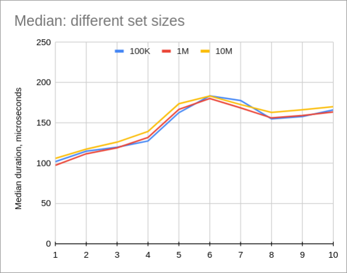
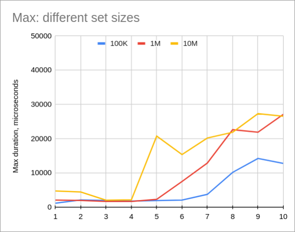
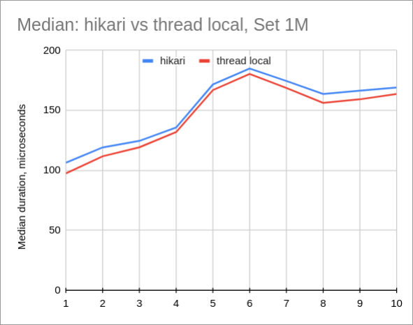
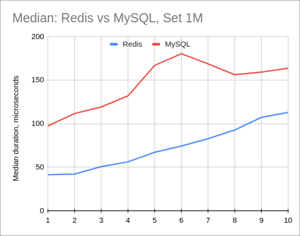
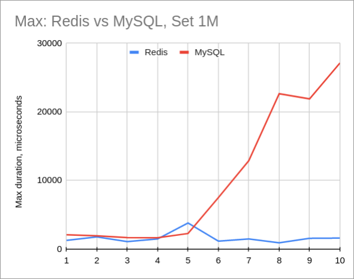

This is the next portion of my "research" around my UUID set cache. I've benchmarked [Map Performance Java vs Scala](/p/map-performance-java-vs-scala), [binary search instead of HashSet](/p/replacing-hash-set-with-sorted-array-in-java) and even moving Set cache to [Redis](/p/ultimate-off-heap-hash-set-using-redis). Now it's time to benchmark [MySQL](https://www.mysql.com/) as such cache.

This is a silly benchmark, I know. But just for the whole picture :) Hope I'm not going to benchmark other out-of-process stuff with it.

However, I decided to test one more thing, related to [JDBC](https://en.wikipedia.org/wiki/Java_Database_Connectivity), that I wanted to benchmark for a while, but didn't have a good justification to actually spend time on it. Keep on reading!

## What are we testing?

My use case is simple - I have a large in-memory set of [UUID](https://cr.openjdk.java.net/~iris/se/17/latestSpec/api/java.base/java/util/UUID.html), around 1 million keys. This is how I'm going to store it in MySQL:
```sql
CREATE TABLE set1m (
  id BINARY(16) NOT NULL PRIMARY KEY
) ENGINE=InnoDB ROW_FORMAT=DYNAMIC;
```

A [code](https://github.com/dkomanov/stuff/blob/18457ede0177648f611fdce9e962c403e4ac2a21/src/com/komanov/mysql/hashset/UuidHelper.java#L10) to convert UUID to `BINARY(16)` (which is just an array of bytes in JDBC):

```java
public static byte[] toBytes(UUID value) {
    byte[] array = new byte[16];
    ByteBuffer bb = ByteBuffer.wrap(array);
    bb.putLong(value.getMostSignificantBits());
    bb.putLong(value.getLeastSignificantBits());
    return array;
}
```

## Benchmark

Benchmark [code](https://github.com/dkomanov/stuff/blob/18457ede0177648f611fdce9e962c403e4ac2a21/src/com/komanov/mysql/hashset/perf/PerfTester.java) is relatively simple: N threads take UUIDs one by one and make a simple query:

```sql
SELECT 1 FROM set1m WHERE id = ?
```

I benchmarked for one thread to 10 threads.


### Spice It Up!

I was wondering about the overhead of connection pools for a while. At [Wix](https://www.wix.com/) we started to use [HikariCP](https://github.com/brettwooldridge/HikariCP/) a [while ago](https://www.wix.engineering/post/how-does-hikaricp-compare-to-other-connection-pools). We discussed it with a [friend](https://twitter.com/nukemberg), and he claimed that it's not smart to use connection pools in blocking environment, that you can simply use thread locals with connections and some housekeeping and it would be much more efficient.

There are some problems with this approach, of course:
* If Jetty (or any other servlet container) uses all its threads from the pool, then we would be using more connections than we actually should.
* Housekeeping is tricky. Also it's impossible to warm-up connections or at least not simple (issue HTTP calls on startup?)

Anyway, in the benchmark it's a nice opportunity to actually check it without writing complex code for housekeeping of connections and such. So, this is what I did: compared HikariCP with pre-warmed up connections versus pre-warmed up connections stored in [ThreadLocal](https://docs.oracle.com/en/java/javase/17/docs/api/java.base/java/lang/ThreadLocal.html).

## Results

Median query time doesn't really depend on table size. However, 10M table is slightly slower (few microseconds):



On the contrary, maximum query time seem to depend a bit on a table size. I'm wondering why? I set [innodb_buffer_pool_size](https://dev.mysql.com/doc/refman/8.0/en/innodb-parameters.html#sysvar_innodb_buffer_pool_size) to 1G, which is larger than table size.



### HikariCP vs Thread Local

Median time is consistently better for Thread Local, 3-8 microseconds difference. This is about 10% for querying localhost, but usually we query MySQL over the network, so it would be 1% or less of the overhead. Not great, not terrible.



### MySQL vs Redis

Predictably, Redis has better performance than MySQL. Even though data set in MySQL is really small (hundreds of megabytes), overhead of SQL seems to be too significant.



And if we look at the maximum request duration, it's even worse. Meaning that MySQL consumes much more CPU than Redis:



## Conclusion

For sure, MySQL doesn't fit this use case at all. It makes a lot of sense, the strength of MySQL isn't here, but in stability, replication, transactions and many more.

It was fun (as usual) to benchmark different aspects of MySQL. I also happy that I don't need to write housekeeping code for thread local connection pool to benchmark it (I guess it was more than 4 years in my backlog), because I'd rather explore async access to MySQL and not blocking.


Full data and charts for [MySQL](https://docs.google.com/spreadsheets/d/1KIqIylWCsy0pc6a9gTDzlckxCe3ppbMu3f7OaIlnnAg) and [MySQL vs Redis](https://docs.google.com/spreadsheets/d/1f4gG-muUXa_wYlLxlLMRUk4cRT8UQCfLxoGgza-Mv-k). Source code is on [GitHub](https://github.com/dkomanov/stuff/commit/30101587ec9ecaddcf0e0f706f4565b22e3d5739). Originally posted on [Medium](https://dkomanov.medium.com/mysql-as-redis-vs-redis-74b788af9c6f). [Cover image](https://pixabay.com/illustrations/truck-vehicle-transport-cut-off-6578684/) by [divotomezove](https://pixabay.com/users/divotomezove-1979640) from [Pixabay](https://pixabay.com/).
