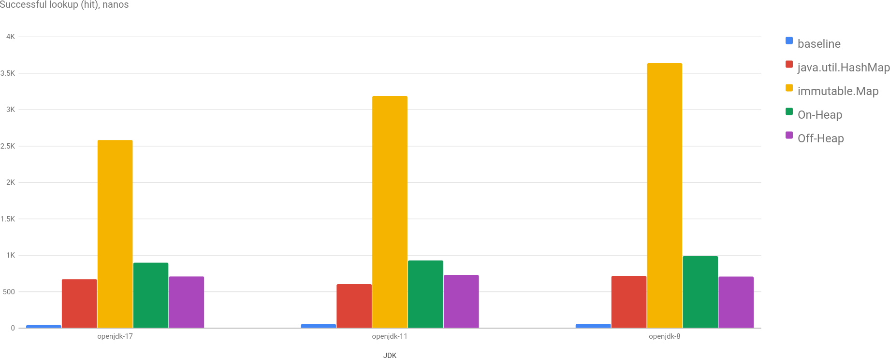
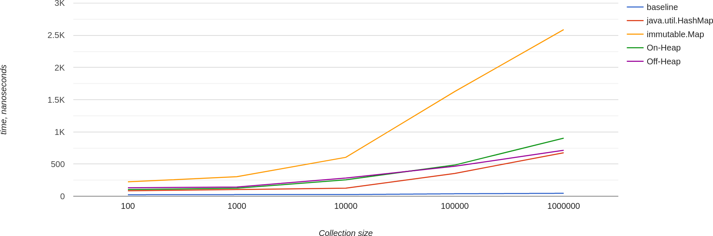
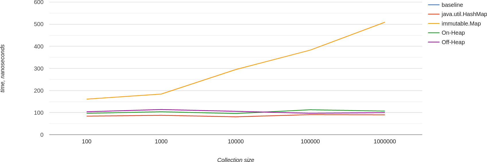

Wow, that's the fifth (and I hope that last, famous last words) episode in my series "Benchmarking something that almost no one needs" :) I [explored performance](/p/map-performance-java-vs-scala) of java.util.HashMap vs scala.Map, and then tried to [replace](/p/replacing-hash-set-with-sorted-array-in-java) HashSet with sorted array and binary search, also storing this array off-heap. Then I went not only off-heap, but also out-of-process with [Redis](/p/ultimate-off-heap-hash-set-using-redis) and later on with [MySQL](/p/mysql-as-redis-vs-redis).

On the MySQL bit I hoped my strange interest in this topic will die off, but no... There was one thing I wanted to try and initially decided not to spend time on it. But since I spent some time on Redis and MySQL, which were completely out of the initial scope, why not to benchmark something that I actually wanted :)

As always, doing more benchmarks I'm getting newer insights, this post isn't an exception in this regard, I invalidated, in a way, benchmark results of [Map Performance: Java vs Scala](/p/map-performance-java-vs-scala).

## What do I benchmark?

The use case I benchmark in all these blog posts is this: I have a cache of ~1 million [UUIDs](https://cr.openjdk.java.net/~iris/se/17/latestSpec/api/java.base/java/util/UUID.html). And for the simplicity sake we can say that this cache changes rarely, meaning that once in a while we can even recreate entire cache, so we may consider it a read only cache.

Then I want to find out the memory footprint of my cache, and minimize it if possible. To quickly reiterate the memory footprint: UUID has 16 bytes of meaningful data, but actually takes 32 bytes on heap; HashMap multiplies it at least by 2, so 1M UUIDs will occupy at least 64MB on heap (actually a little bit more). Sorted array off-heap takes 16MB, but it's performance is not as good.

I mentioned [Valhalla Project](https://openjdk.org/projects/valhalla/) which will allow to reduce some overhead and HashMap will take less space. And I decided not to wait but implement simple HashMap off-heap and benchmark its performance.

## Off-Heap HashMap

Good thing is I don't need a generic solution, so I decided to implement `Map<UUID, Integer>` using off-heap memory (via [Unsafe](https://github.com/openjdk/jdk/blob/master/src/java.base/share/classes/jdk/internal/misc/Unsafe.java#L621)). The simplest HashMap implementation would be an array of entries like this:
```java
class Entry {
    public int hash;
    public int next;
    public long mostSignificantBits;
    public long leastSignificantBits;
    public int value;
}
```

1M keys - array of 1M entries. The way we distribute keys is this:
```
int index = Math.abs(key.hashCode()) % entries.length;
```

If we have a collision, find an empty spot for entry, set `next` to that index, and when we search, we just need to iterate over all collisions to find (or not) the match. This way we store linked list in an array.

The size of `Entry` is 28 bytes -- 12 bytes overhead. We could probably save a byte of two. On the other side, it might be beneficial to add 4 bytes just to have 32-bytes entry, which will be aligned in memory nicely.

## I Did It Wrong!

Because I was implementing HashMap, I suddenly realized, that the way I benchmarked before wasn't right, because I didn't benchmark cases with collisions (or it wasn't consistent).

The way I did it: on initialization phase I picked 10 random UUIDs from the map and then I ran benchmark with those 10 UUIDs. On one hand it basically tests certain spots in memory, so it's always hot and cached. It might be ok if the use case very close to it. But I want to know performance not for the best case. So I came up with the idea of benchmarking against all keys, not just random 10. And the result is quite different from what I got before.

## Benchmarks!

I ran benchmarks for `java.lang.HashMap`, `scala.collection.immutable.Map` and 2 implementations of read only maps, one is on-heap and another is off-heap. The implementation of these maps is literally the same, except for the memory layout part. Basically, with the Project Valhalla I'd expect its performance and memory layout should be almost identical (in theory).

As you may see on the chart, the performance of off-heap read only Map is very close to `java.util.HashMap`, very close.



An interesting chart of successful lookup for all benchmarked sizes. We can see that the performance actually depends on the size, but it grows slowly (not for Scala, though).



For failed lookups (misses) performance is pretty much stable (not for Scala). It could be that iteration over all keys decreases the efficiency of memory caches, and for misses we use static list of 10 UUIDs. Maybe I need to generate same number of UUIDs and iterate over it...



## Conclusion

My simplest implementation of read-only Map stored off-heap is better memory-wise and very close in terms of performance to a `java.util.HashMap`, which is cool. If memory and GC pressure is important in the application, I'd probably consider moving to this data structure to improve resiliency of the application.

To conclude the series, in short:

Performance-wise: `java.util.HashMap` ~ off-heap HashMap > `mutable.HashMap` > `immutable.Map` > `Array<UUID>` > Redis > MySQL.

Memory-wise: `Array<UUID>` < off-heap HashMap < `java.util.HashMap`/`mutable.HashMap` < Redis ~ MySQL.

It's actually wonderful that such topic has so many ways to explore both in depth and in breadth. But I have to stop somewhere, and I guess this is a good place, where I did an virtual experiment how would it work with Valhalla, and I hope it will be something like it.


Play with charts [here](/charts/offheap-hashmap). Source code is on [GitHub](https://github.com/dkomanov/stuff/commit/b28f52a4540aafd247a21fd31865a823943e0338). Originally posted on [Medium](https://dkomanov.medium.com/replacing-hashmap-with-off-heap-hashmap-in-java-ffb560e07b5). [Cover image](https://pixabay.com/photos/wheel-loader-wheel-cat-938m-heap-2580470/) by [Rico S.](https://pixabay.com/users/ricobino-1987569/) from [Pixabay](https://pixabay.com/).
