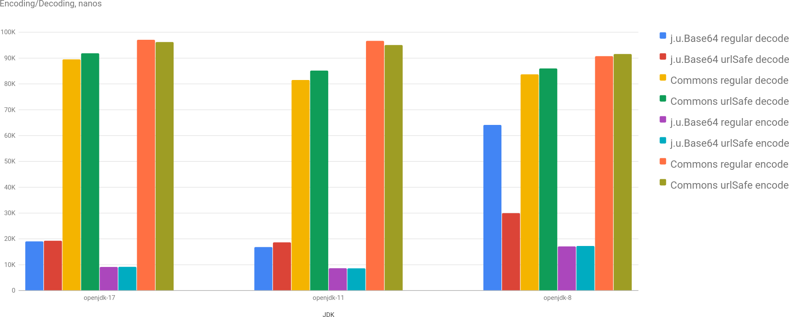
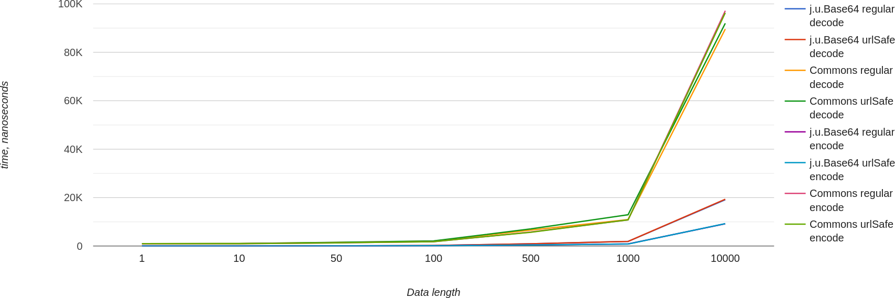

UPD. [Charts](/charts/base64-jdk-vs-apache-commons) updated with better input data.

Recently I stumbled upon some old code that used [Base64](https://commons.apache.org/proper/commons-codec/apidocs/org/apache/commons/codec/binary/Base64.html) from [Apache Commons](https://commons.apache.org/proper/commons-codec/). So I decided to compare its performance to [java.util.Base64](https://docs.oracle.com/en/java/javase/17/docs/api/java.base/java/util/Base64.html).

It's not a new topic whatsoever (links at the end), so let's just jump to benchmark results.

## Benchmarks

Performance for encoding 10K characters for different JDKs. `java.util.Base64` is a clear winner performing almost 10x faster.

Performance for different data sizes (from 1 byte to 10K bytes) for openjdk-17. As you could see in the previous chart, openjdk-8 performs worse, but still `java.util.Base64` is clearly better in all cases.

## Conclusion

It's clearly a time to replace old usages of Apache Commons for base64 encoding. Unless you are on JDK7 or lower, then it's time to upgrade this part first ;-) (as `java.util.Base64` was introduced in JDK8)

### Read More

* [Base64 encoding and decoding performance](https://web.archive.org/web/20220514013436/http://java-performance.info/base64-encoding-and-decoding-performance/): a big good article from 2014 with multiple libraries comparison. Site doesn't exist anymore, so link to [web archive](https://web.archive.org/).
* [A Fast and Correct Base 64 Codec](https://aws.amazon.com/blogs/developer/a-fast-and-correct-base-64-codec/): AWS's take on base64 (spoiler, their implementation is more "correct").
* [Follow up on Base64 Codec Performance](https://aws.amazon.com/blogs/developer/follow-up-on-base64-codec-performance/): AWS's performance benchmark.
* [Java Base64 Encoding and Decoding](https://www.baeldung.com/java-base64-encode-and-decode): basic tutorial.

Play with charts [here](/charts/base64-jdk-vs-apache-commons). Source code is on [GitHub](https://github.com/dkomanov/stuff/commit/fec95163cc428d486d7d61fb2b6c2d3126aca44f). Originally posted on [Medium](https://dkomanov.medium.com/base64-encoding-performance-jdk-vs-apache-commons-3fb83323414b). [Cover image](https://pixabay.com/illustrations/sport-athlete-track-runner-field-3677470/) by [mohamed_hassan](https://pixabay.com/users/mohamed_hassan-5229782/) from [Pixabay](https://pixabay.com/).
