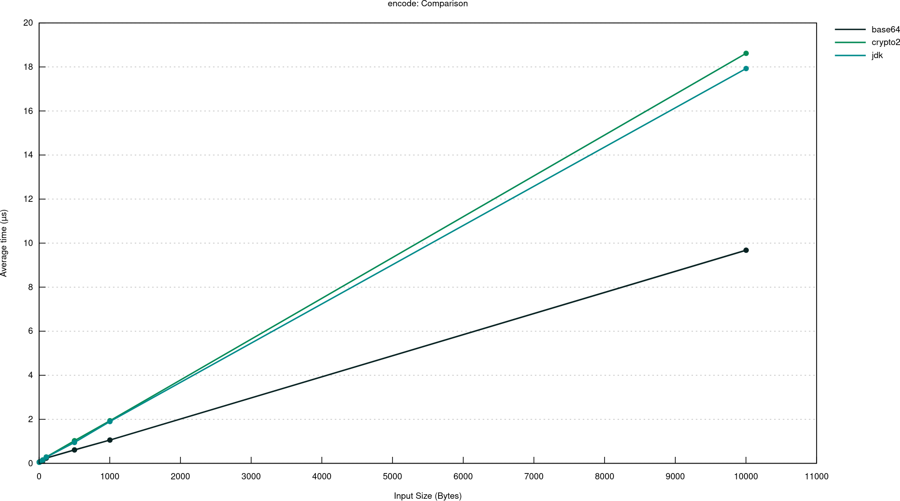

UPD: A lot of interesting comments on [reddit](https://www.reddit.com/r/rust/comments/y5c91j/base64_encoding_performance_java_vs_rust/):
* [Added](https://github.com/dkomanov/rust-stuff/commit/50b7cfd686ca3d23fcf4ee78483e5d6dafe35a57) benchmarks for [data-encoding](https://docs.rs/data-encoding/latest/data_encoding/) crate.
* [Added](https://github.com/dkomanov/rust-stuff/commit/c222a95fae0812303c931d36d09b5acc7d1a95d8) an [optimized](https://gist.github.com/Measter/e3d12d78777c9e1b125f0466c6b94498) [version](https://godbolt.org/z/5jEeq9713) of JDK ported implementation that brings Rust closer to JVM for encoding.
* WOW. Merged [PR](https://github.com/dkomanov/rust-stuff/pull/1) using [base64-simd](https://github.com/Nugine/simd) crate, which performance is almost 10x better than anything else!

I got curious... Not that's something new to me. But a bit unusual thought after benchmarking [Base64](/p/base64-encoding-performance-jdk-vs-apache-commons) performance in Java: what is the maximum performance in unmanaged world? And since I wanted to explore [Rust](https://www.rust-lang.org/) a bit, I decided that it's a good opportunity!

I went to google to find something about benchmarking base64 encoding performance for Rust and stumbled upon a github [issue](https://github.com/marshallpierce/rust-base64/issues/159) saying that crate [base64](https://crates.io/crates/base64) isn't that fast. That opened an opportunity for me to check it.

## What Are We Benchmarking?

* [base64](https://crates.io/crates/base64) crate.
* Base64 encoding/decoding from [crypto2](https://crates.io/crates/crypto2) crate. Sadly, it's not published so I had to copy-paste its code for benchmarking.
* [java.util.Base64](https://docs.oracle.com/en/java/javase/17/docs/api/java.base/java/util/Base64.html): I [ported](https://github.com/dkomanov/rust-stuff/tree/9daaadd43fc76b821614a318e3169eb3d2303371/base64_jdk/src) implementation from Java to Rust for benchmarking purposes.

And then I want to compare it with the results of JVM benchmarks on the same inputs.

For benchmarking Rust I used [criterion.rs](https://github.com/bheisler/criterion.rs), a very nice tool for benchmarking. It does much more out of the box than [JMH](https://github.com/openjdk/jmh). The hardware configuration is Intel® Core™ i7-1165G7 @ 2.80GHz × 8 (4 core + 4 HT) with 16 GB RAM.

## Benchmarks

Here are couple of graphs for Rust only, generated by Criterion: for encode and decode performance. `base64` implementation is a clear winner here for both encoding and decoding.

Performance of [encoding](/data/charts/base64-rust/encode/index.html) for different input data sizes.



Performance of [decoding](/data/charts/base64-rust/decode/index.html) for different input data sizes.


For the decoding you may notice that I benchmarked 2 methods from `base64`: `decode_config` and `decode_config_slice`. The reason is that they have a [bug](https://github.com/marshallpierce/rust-base64/issues/195) in their implementation: `decode_config` allocates significantly more memory than it's needed. But the difference in terms of performance is very small (around 10%). It was [fixed](https://github.com/marshallpierce/rust-base64/commit/5c043f9b74114b3e9a3bb98b07ba917963b0b815), but not in the most efficient way, and still not published.

### Versus Java

Let's compare performance for 1K input Rust vs Java: and immediately -- WOW!

For encoding Java performs better than Rust O_O:

```
method                       input  output  avg time
base64::encode_config         1002    1336      1078
crypto2::encode_with_config   1002    1336      1977
jdk::encode                   1002    1336      1913
j.u.Base64.Encoder            1002    1336       872
```

And even ported almost 1-to-1 implementation is 2 times slower than Java.

For decoding everything looks normal: ported implementation has comparable performance and Rust's implementation is about 2 times faster than Java.

```
method                       input  output  avg time
base64::decode_config         1336    1002      1163
base64::decode_config_slice   1336    1002      1075
crypto2::decode_with_config   1336    1002      4014
jdk::decode                   1336    1002      1985
j.u.Base64.Decoder            1336    1002      1930
```

And the full table for different input sizes:

```
method                       input  output  avg time
base64::encode_config           12      16        76
base64::encode_config           51      68       120
base64::encode_config          102     136       184
base64::encode_config          501     668       584
base64::encode_config         1002    1336      1078
crypto2::encode_with_config     12      16        67
crypto2::encode_with_config     51      68       145
crypto2::encode_with_config    102     136       274
crypto2::encode_with_config    501     668      1101
crypto2::encode_with_config   1002    1336      1977
jdk::encode                     12      16        70
jdk::encode                     51      68       138
jdk::encode                    102     136       262
jdk::encode                    501     668      1004
jdk::encode                   1002    1336      1913
j.u.Base64.Encoder              12      16        46
j.u.Base64.Encoder              51      68        86
j.u.Base64.Encoder             102     136       128
j.u.Base64.Encoder             501     668       446
j.u.Base64.Encoder            1002    1336       872

base64::decode_config           16      12        85
base64::decode_config           68      51       119
base64::decode_config          136     102       174
base64::decode_config          668     501       584
base64::decode_config         1336    1002      1163
base64::decode_config_slice     16      12        76
base64::decode_config_slice     68      51       152
base64::decode_config_slice    136     102       165
base64::decode_config_slice    668     501       586
base64::decode_config_slice   1336    1002      1075
crypto2::decode_with_config     16      12        96
crypto2::decode_with_config     68      51       239
crypto2::decode_with_config    136     102       442
crypto2::decode_with_config    668     501      1934
crypto2::decode_with_config   1336    1002      4014
jdk::decode                     16      12        75
jdk::decode                     68      51       150
jdk::decode                    136     102       254
jdk::decode                    668     501      1007
jdk::decode                   1336    1002      1985
j.u.Base64.Decoder              16      12        53
j.u.Base64.Decoder              68      51       128
j.u.Base64.Decoder             136     102       231
j.u.Base64.Decoder             668     501       977
j.u.Base64.Decoder            1336    1002      1930
```

## Conclusion

An unexpected result of Java outperforming Rust in encoding will please Java users :) Even though it's totally possible for Java to outperform unmanaged code, it's a rare case. Let's celebrate :)

I liked the opportunity to compare Java versus Rust. I rarely cross boundaries of my main platform (Scala, JDK). I will probably do it more in the future.


Full criterion report is [here](/data/charts/base64-rust/index.html). Source code is on [GitHub](https://github.com/dkomanov/rust-stuff/tree/4e80056ef990e70f64a7fe12986d14a881999818/base64_bench/benches). Originally posted on [Medium](https://dkomanov.medium.com/base64-encoding-performance-java-vs-rust-c59f438411f0). [Cover image](https://pixabay.com/vectors/train-bullet-speed-grey-red-309824/) by [Clker-Free-Vector-Images](https://pixabay.com/users/clker-free-vector-images-3736/) from [Pixabay](https://pixabay.com/) (plus my gimp madskillz).
