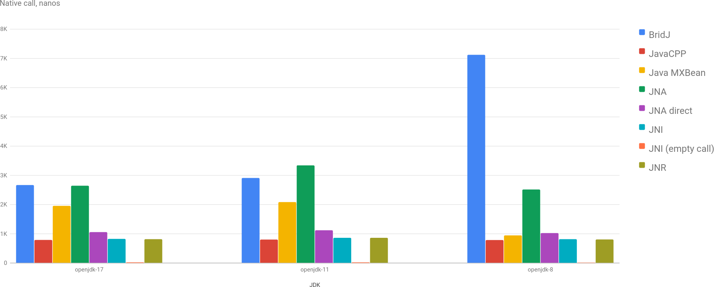

This is a remake of [java-native-benchmark](https://github.com/zakgof/java-native-benchmark): performance benchmark of different ways (libraries) of using native libraries. The original benchmark was created for Windows, and I'm more interested in Linux. I tried to fork the original repo, but I failed to make gradle work with IntelliJ, so I created with in my own bazel (ironical, yes) repo.

In the nearest future I'm going to run a more sophisticated benchmark for native calls.

## What Are We Benchmarking?

In the original benchmark function [GetSystemTime](https://learn.microsoft.com/en-us/windows/win32/api/sysinfoapi/nf-sysinfoapi-getsystemtime) from Windows API was called. On Linux I decided to go with the simpler one: [getloadavg](https://man7.org/linux/man-pages/man3/getloadavg.3.html) from libc.

Tested libraries:
* [JNI](https://docs.oracle.com/en/java/javase/17/docs/specs/jni/index.html): Java's standard native interop mechanism.
* [JNA](https://github.com/java-native-access/jna)
* [BridJ](https://github.com/nativelibs4java/BridJ)
* [JNR-FFI](https://github.com/jnr/jnr-ffi/)
* [JavaCPP](https://github.com/bytedeco/javacpp)
* "Pure" Java: getting load average via [JMX](https://docs.oracle.com/en/java/javase/17/docs/api/java.management/java/lang/management/OperatingSystemMXBean.html#getSystemLoadAverage()).

I didn't use Panama as it requires too much of an effort. If you're interested, there is a very good long [tutorial](https://foojay.io/today/project-panama-for-newbies-part-1/).

## Benchmarks

Benchmark is very simple and straight-forward. The fastest access is via JNI, JNR and JavaCPP. Interestingly enough, JMX is slower than JNI, which is a little bit unexpected.

JNI empty just shows a baseline, which is about 22 nanoseconds on my laptop. Seemingly, not a huge overhead (for a [simple function](https://github.com/dkomanov/stuff/blob/87c45ac0063e8dce320778421e203e96493b5f94/rs/getloadavg/getloadavg.rs#L18) that takes `int` and returns it back).

However, if we will compare it with a [native benchmark](https://github.com/dkomanov/rust-stuff/commit/2012909006ac02494d5573d1b7a28c2ace1bd2ea), in which `getloadavg` takes approximately 470 nanoseconds. Then the actual overhead in this scenario vs the best result of 794 nanoseconds would be 300+ nanoseconds.

## Conclusion

A call to a native library is not cheap. But still might be beneficial comparing to JDK in terms of performance. JNI has a similar performance to JNR-FFI and JavaCPP, but requires to write a native library using [jni.h](https://github.com/openjdk/jdk/blob/master/src/java.base/share/native/include/jni.h) or [jni crate](https://docs.rs/jni/latest/jni/) for Rust.

Play with charts [here](/charts/native-access). Source code is on [GitHub](https://github.com/dkomanov/stuff/tree/4fd2ccf8713d58dcb1e2fb87c7d0208c0ffc5121/src/com/komanov/nativeaccess). Originally posted on [Medium](https://dkomanov.medium.com/java-native-access-performance-cf4ce0d68ddb). [Cover](https://pixabay.com/photos/computer-connection-connector-20687/) [image](https://pixabay.com/photos/coffee-beans-texture-bean-food-1223055/) by madskillz from [Pixabay](https://pixabay.com/).
