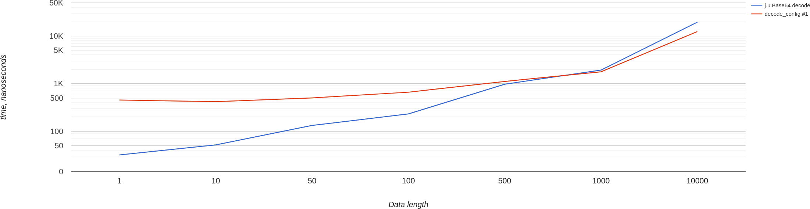
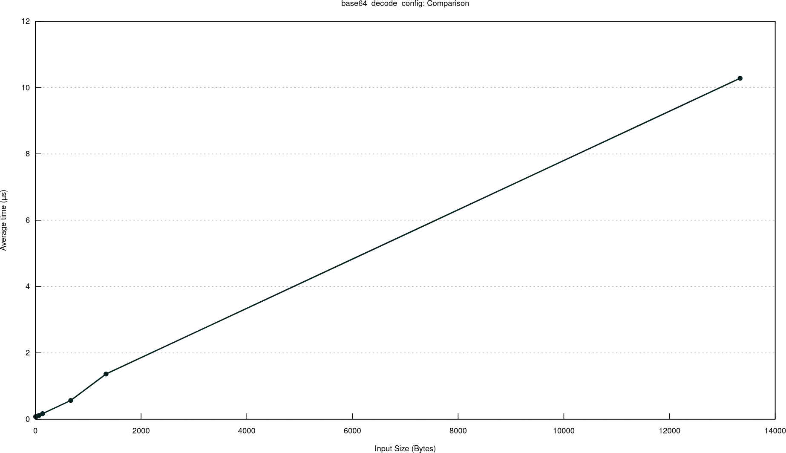
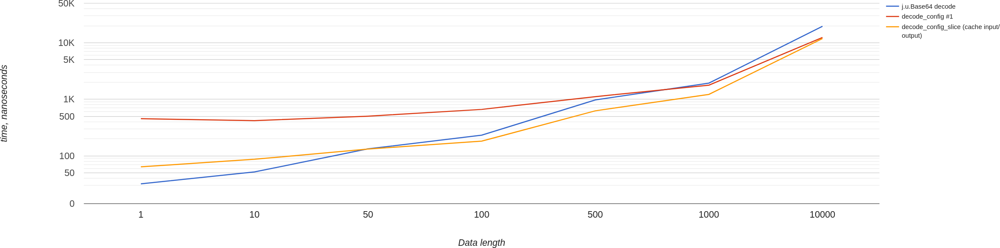
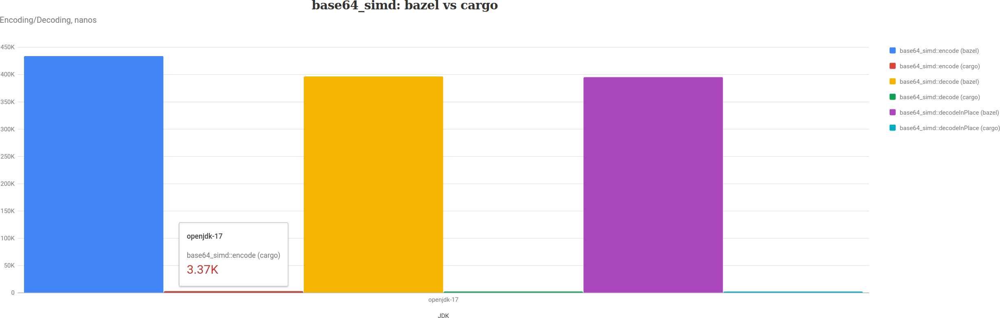

It's time to consolidate my [Base64](https://en.wikipedia.org/wiki/Base64) findings: take the best of [JVM](/p/base64-encoding-performance-jdk-vs-apache-commons) world, the best of [Rust](/p/base64-encoding-performance-java-vs-rust) world and benchmark it together from [within](/p/java-native-access-performance) the JVM.

In this article I'm going to benchmark Base64 encoding/decoding performance of [java.util.Base64](https://docs.oracle.com/en/java/javase/17/docs/api/java.base/java/util/Base64.html) versus [base64](https://crates.io/crates/base64) and [base64-simd](https://github.com/Nugine/simd) crates via [JNI](https://docs.oracle.com/en/java/javase/17/docs/specs/jni/index.html). Along the way we will explore intricacies of calling native libraries from JVM and ways to improve its performance.

Let's start from beginning...

## How to JNI?

There are multiple resources on how to work with JNI. For example this [guide](https://www.baeldung.com/jni). Because I'm going to use Rust, the relevant guide is on the [jni crate](https://docs.rs/jni/latest/jni/) documentation itself. Basically, we start with something simple:

```java
package com.komanov.jwt.base64.jni;

public abstract class NativeBazel {
    static {
        System.loadLibrary("base64_lib");
    }

    public static native byte[] decodeConfigUrlSafe1(byte[] encoded);
}
```

Then we need to generate a C-header file for it:
```sh
java -h NativeBazel.java
```

In return we get file `com_komanov_jwt_base64_jni_NativeBazel.h`:
```cpp
/* DO NOT EDIT THIS FILE - it is machine generated */
#include <jni.h>
/* Header for class com_komanov_jwt_base64_jni_NativeBazel */

#ifndef _Included_com_komanov_jwt_base64_jni_NativeBazel
#define _Included_com_komanov_jwt_base64_jni_NativeBazel
#ifdef __cplusplus
extern "C" {
#endif
/*
 * Class:     com_komanov_jwt_base64_jni_NativeBazel
 * Method:    decodeConfigUrlSafe1
 * Signature: ([B)[B
 */
JNIEXPORT jbyteArray JNICALL
  Java_com_komanov_jwt_base64_jni_NativeBazel_decodeConfigUrlSafe1
  (JNIEnv *, jclass, jbyteArray);
  #ifdef __cplusplus
}
#endif
#endif
```

And for Rust we need to create a file (we need to use a generated function name `Java_com_komanov_jwt_base64_jni_NativeBazel_decodeConfigUrlSafe1`, but it's very long, so I cut it just for the post to look good):

```rust
use base64;
use jni::JNIEnv;
use jni::objects::JClass;
use jni::sys::jbyteArray;

#[no_mangle]
pub extern "system" fn decodeConfigUrlSafe1(
  env: JNIEnv,
  _class: JClass,
  payload: jbyteArray,
) -> jbyteArray {
  let result = base64::decode_config(
    env.convert_byte_array(payload).unwrap(),
    base64::URL_SAFE_NO_PAD
  ).unwrap();
  return env.byte_array_from_slice(&result).unwrap();
}
```

This would be our first and the simplest implementation using [base64](https://docs.rs/base64/latest/base64/) crate.

Also, don't forget to make your native library (libbase64_lib.so in case of Linux) discoverable to JVM by specifying it's location via command line argument `-Djava.library.path=`.

## The First Benchmark

Next thing is to write a benchmark Java vs Rust via JNI. Easy, right? First results:

```
Benchmark              (length)      Score       Error  Units

jdk_url_decode              100    232.112 ±     3.565  ns/op
jni_url_decodeConfig1       100    662.213 ±    30.668  ns/op

jdk_url_decode            10000  19530.268 ±   590.507  ns/op
jni_url_decodeConfig1     10000  12403.311 ±    99.469  ns/op
```

And the chart for all payload sizes (openjdk-17, for previous versions JDK implementation performs slightly worse):



Somewhere between payload size of 500 and 1000 performance converges and then Rust via JNI starts to perform better. However... If we take a look on the Rust performance without JNI, we would see [this](/data/charts/base64-rust/base64_decode_config/index.html):



It's actually pretty close: 12.4 μs (microseconds) with JNI vs 10.2 μs without JNI. Approximately 20% overhead of JNI. Let's try to decrease it.

## Optimize It!

**Disclaimer 1**: I didn't save actual results from all different runs, so I'm going to use the final results, but I'm going to describe everything in the more or less the same order as I proceeded during my research.

**Disclaimer 2**: micro-optimizations aren't simple, the benchmarking results are not [that simple](http://wiki.jvmlangsummit.com/images/1/1d/PerformanceAnxiety2010.pdf), beware of it -- you need to benchmark your system yourself, sometimes successful benchmark of a smaller thing may not be visible after integration to a bigger system.

Let's take a look at the implementation again:
```rust
#[no_mangle]
pub extern "system" fn decodeConfigUrlSafe1(
  env: JNIEnv,
  _class: JClass,
  payload: jbyteArray,
) -> jbyteArray {
  let result = base64::decode_config(
    env.convert_byte_array(payload).unwrap(),
    base64::URL_SAFE_NO_PAD
  ).unwrap();
  return env.byte_array_from_slice(&result).unwrap();
}
```

Here we perform 3 operations:
1. [env.convert_byte_array](https://docs.rs/jni/latest/jni/struct.JNIEnv.html#method.convert_byte_array) converts `byte[]` to `Vec<u8>`: we can't access directly byte array, because it's in a managed heap of JVM and may be moved.
2. [decode_config](https://docs.rs/base64/latest/base64/fn.decode_config.html) decodes Base64.
3. [env.byte_array_from_slice](https://docs.rs/jni/latest/jni/struct.JNIEnv.html#method.byte_array_from_slice) converts `[u8]` (byte slice) back to `byte[]`.

Let's try to replace certain parts and see how it affects the performance.

### Use get_byte_array_elements instead of convert_byte_array

There are few methods for working with array, one of them is [get_byte_array_elements](https://docs.rs/jni/latest/jni/struct.JNIEnv.html#method.get_byte_array_elements):

```rust
#[no_mangle]
pub extern "system" fn decodeConfigUrlSafe2(
  env: JNIEnv,
  _class: JClass,
  payload: jbyteArray,
) -> jbyteArray {
  let arr = env.get_byte_array_elements(
    payload,
    ReleaseMode::NoCopyBack,
  ).unwrap();
  let sl = unsafe {
    from_raw_parts(arr.as_ptr() as *mut u8, arr.size().unwrap() as usize)
  };
  let result = base64::decode_config(sl, base64::URL_SAFE_NO_PAD).unwrap();
  return env.byte_array_from_slice(&result).unwrap();
}
```

And the benchmark:
```
Benchmark              (length)      Score       Error  Units

jni_url_decodeConfig1       100    662.213 ±    30.668  ns/op
jni_url_decodeConfig2       100    538.772 ±     4.381  ns/op

jni_url_decodeConfig1     10000  12403.311 ±    99.469  ns/op
jni_url_decodeConfig2     10000  12355.233 ±   620.308  ns/op
```

Slightly better.

### Passing array size explicitly

Under the hood of `arr.size()` is another call to `JNIEnv` object to [get_array_length](https://docs.rs/jni/latest/jni/struct.JNIEnv.html#method.get_array_length) method. Instead of that we can pass array's length via arguments (and hope that marshalling of `int` is very cheap):

```rust
#[no_mangle]
pub extern "system" fn decodeConfigUrlSafe3(
  env: JNIEnv,
  _class: JClass,
  payload: jbyteArray,
  size: usize,
) -> jbyteArray {
  let arr = env.get_byte_array_elements(
    payload,
    ReleaseMode::NoCopyBack,
  ).unwrap();
  let sl = unsafe {
    from_raw_parts(arr.as_ptr() as *mut u8, size)
  };
  let result = base64::decode_config(sl, base64::URL_SAFE_NO_PAD).unwrap();
  return env.byte_array_from_slice(&result).unwrap();
}
```

And the benchmark:
```
Benchmark              (length)      Score       Error  Units

jni_url_decodeConfig2       100    538.772 ±     4.381  ns/op
jni_url_decodeConfig3       100    505.095 ±    44.893  ns/op

jni_url_decodeConfig2     10000  12355.233 ±   620.308  ns/op
jni_url_decodeConfig3     10000  12252.848 ±    40.396  ns/op
```

Slightly better.

### Use get_primitive_array_critical instead of get_byte_array_elements

Yet another way of accessing `byte[]` is by using [get_primitive_array_critical](https://docs.rs/jni/latest/jni/struct.JNIEnv.html#method.get_primitive_array_critical). There's [caveat](https://stackoverflow.com/questions/23258357/whats-the-trade-off-between-using-getprimitivearraycritical-and-getprimitivety) of using this method: it may prevent Garbage Collector from running, so it's assumed that this method should be accessed for a short period of time, without any extra calls to JNI.

```rust
pub extern "system" fn decodeConfigUrlSafe4(
  env: JNIEnv,
  _class: JClass,
  payload: jbyteArray,
  size: usize,
) -> jbyteArray {
  let arr = env.get_primitive_array_critical(
    payload,
    ReleaseMode::NoCopyBack,
  ).unwrap();

  let sl = unsafe {
    from_raw_parts(arr.as_ptr() as *mut u8, size)
  };

  let result = base64::decode_config(sl, base64::URL_SAFE_NO_PAD).unwrap();
  return env.byte_array_from_slice(&result).unwrap();
}
```

And the benchmark:
```
Benchmark              (length)      Score       Error  Units

jni_url_decodeConfig3       100    505.095 ±    44.893  ns/op
jni_url_decodeConfig4       100    455.117 ±     3.990  ns/op

jni_url_decodeConfig3     10000  12252.848 ±    40.396  ns/op
jni_url_decodeConfig4     10000  11942.370 ±   330.573  ns/op
```

Slightly better :)

### Use base64::decode_config_slice

At the time of this benchmark, there was a [bug](https://github.com/marshallpierce/rust-base64/issues/195) that allocated more memory then needed in `decode_config` method, so I tried to allocate memory by myself:

```rust
#[no_mangle]
pub extern "system" fn decodeConfigSliceUrlSafe1(
  env: JNIEnv,
  _class: JClass,
  payload: jbyteArray,
  size: usize,
) -> jbyteArray {
  let mut buffer = Vec::<u8>::with_capacity(size * 3 / 4);
  let arr = env.get_byte_array_elements(
    payload,
    ReleaseMode::NoCopyBack,
  ).unwrap();
  let (input_slice, mut output_slice) = unsafe {
    (
      from_raw_parts(arr.as_ptr() as *const u8, size),
      from_raw_parts_mut(buffer.as_mut_ptr(), buffer.capacity()),
    )
  };

  let size = base64::decode_config_slice(
    input_slice,
    base64::URL_SAFE_NO_PAD,
    &mut output_slice,
  ).unwrap();
  // simplified assert, correct probably only for benchmark data.
  assert_eq!(size, buffer.capacity());

  unsafe {
    buffer.set_len(size);
  }

  return env.byte_array_from_slice(&buffer).unwrap();
}
```

And the benchmark:
```
Benchmark               (length)      Score       Error  Units

jni_url_decodeConfig2        100    538.772 ±     4.381  ns/op
jni_url_decodeConfig4        100    455.117 ±     3.990  ns/op
jni_url_decodeConfigSlice1   100    506.076 ±     5.490  ns/op

jni_url_decodeConfig2      10000  12355.233 ±   620.308  ns/op
jni_url_decodeConfig4      10000  11942.370 ±   330.573  ns/op
jni_url_decodeConfigSlice1 10000  12318.419 ±   283.668  ns/op
```

Here we can see, that it performs slightly better than `decode_config` with passing size explicitly optimization. So, we could probably add all other optimizations and it will be slightly better. But what are the next possible optimizations here?

Actually, we have 2 things going here:
1. Marshalling of encoded `byte[]` as input argument.
2. Marshalling of decoded result as `byte[]` as returned value.

Could it be that JVM's marshalling mechanism isn't the most robust for our specific problem?

### Allocate off-heap memory for the output

For off-heap allocation we can use [Unsafe](https://github.com/openjdk/jdk/blob/jdk-19+36/src/java.base/share/classes/jdk/internal/misc/Unsafe.java#L621) class. Method `allocateMemory` will return a `long` value, which represents an address in off-heap memory, which we need to pass via JNI.

In Java it would look like this:
```java
public static native int decodeConfigSliceUrlSafe2(
  byte[] encoded,
  int size,
  long address,
  int outputSize
);
```

And the Rust implementation:

```rust
#[no_mangle]
pub extern "system" fn decodeConfigSliceUrlSafe2(
  env: JNIEnv,
  _class: JClass,
  payload: jbyteArray,
  size: usize,
  output: *mut u8,
  output_size: usize,
) -> usize {
  let arr = env.get_byte_array_elements(
    payload,
    ReleaseMode::NoCopyBack,
  ).unwrap();

  let (input_slice, output_slice) = unsafe {
    (
      std::slice::from_raw_parts(arr.as_ptr() as *const u8, size),
      std::slice::from_raw_parts_mut(output, output_size),
    )
  };

  return base64::decode_config_slice(
    input_slice,
    base64::URL_SAFE_NO_PAD,
    output_slice,
  ).unwrap();
}
```

As a result we return an actual number of decoded bytes. And then in Java we need to [create a byte array](https://github.com/dkomanov/stuff/blob/7f808056d53fd891bacb83e53f559614c675e693/src/com/komanov/jwt/base64/jni/NativeHelper.java#L10-L14) (by using [copyMemory](https://github.com/openjdk/jdk/blob/jdk-19+36/src/jdk.unsupported/share/classes/sun/misc/Unsafe.java#L570)):

```java
byte[] toByteArray(long address, int length) {
  byte[] result = new byte[length];
  unsafe.copyMemory(
    null,
    address,
    result,
    Unsafe.ARRAY_BYTE_BASE_OFFSET,
    length
  );
  return result;
}
```

And also the next optimization for it -- cache in thread local an off-heap memory, so we don't need to allocate/release it for each JNI call.

And the benchmark:
```
Benchmark                      (length)      Score       Error  Units

jni_url_decodeConfig2               100    538.772 ±     4.381  ns/op
jni_url_decodeConfig4               100    455.117 ±     3.990  ns/op
jni_url_decodeConfigSlice1          100    506.076 ±     5.490  ns/op
jni_url_decodeConfigSlice1NoCache   100    378.639 ±     3.030  ns/op
jni_url_decodeConfigSlice2Cache     100    292.331 ±     4.535  ns/op

jni_url_decodeConfig2             10000  12355.233 ±   620.308  ns/op
jni_url_decodeConfig4             10000  11942.370 ±   330.573  ns/op
jni_url_decodeConfigSlice1        10000  12318.419 ±   283.668  ns/op
jni_url_decodeConfigSlice1NoCache 10000  12322.464 ±    91.313  ns/op
jni_url_decodeConfigSlice2Cache   10000  12071.756 ±   134.344  ns/op
```

We can see that for smaller payloads performance improvement is pretty much significant. For larger not so much, but still slightly better.

### Allocate off-heap memory for both input and output

So, the next and (almost) the last step is to use off-heap buffers for both input and output data. This way we completely eliminate marshalling of `byte[]` from JVM to native.

In Java it looks like this:
```java
public static native int decodeConfigSliceUrlSafe3(
  long inputAddress,
  int inputSize,
  long outputAddress,
  int outputSize
);
```

And in Rust:

```rust
#[no_mangle]
pub extern "system" fn decodeConfigSliceUrlSafe3(
  _env: JNIEnv,
  _class: JClass,
  input: *const u8,
  input_size: usize,
  output: *mut u8,
  output_size: usize,
) -> usize {
  let (input_slice, output_slice) = unsafe {
    (
      std::slice::from_raw_parts(input, input_size),
      std::slice::from_raw_parts_mut(output, output_size),
    )
  };
  return base64::decode_config_slice(
    input_slice,
    base64::URL_SAFE_NO_PAD,
    output_slice,
  ).unwrap();
}
```

To copy input `byte[]` to off-heap we may use [this code](https://github.com/dkomanov/stuff/blob/7f808056d53fd891bacb83e53f559614c675e693/src/com/komanov/jwt/base64/jni/NativeHelper.java#L16-L18):
```java
void copyFromByteArray(long address, byte[] input, int inputSize) {
  unsafe.copyMemory(
    input,
    Unsafe.ARRAY_BYTE_BASE_OFFSET,
    null,
    address,
    inputSize
  );
}
```

And the benchmark:
```
Benchmark                               (length)      Score       Error  Units

jdk_url_decode                               100    232.112 ±     3.565  ns/op
jni_url_decodeConfig1                        100    662.213 ±    30.668  ns/op
jni_url_decodeConfig4                        100    455.117 ±     3.990  ns/op
jni_url_decodeConfigSlice1                   100    506.076 ±     5.490  ns/op
jni_url_decodeConfigSlice1NoCache            100    378.639 ±     3.030  ns/op
jni_url_decodeConfigSlice2Cache              100    292.331 ±     4.535  ns/op
jni_url_decodeConfigSlice3CacheInputOutput   100    182.863 ±    26.261  ns/op

jdk_url_decode                             10000  19530.268 ±   590.507  ns/op
jni_url_decodeConfig1                      10000  12403.311 ±    99.469  ns/op
jni_url_decodeConfig4                      10000  11942.370 ±   330.573  ns/op
jni_url_decodeConfigSlice1                 10000  12318.419 ±   283.668  ns/op
jni_url_decodeConfigSlice1NoCache          10000  12322.464 ±    91.313  ns/op
jni_url_decodeConfigSlice2Cache            10000  12071.756 ±   134.344  ns/op
jni_url_decodeConfigSlice3CacheInputOutput 10000  11841.998 ±    60.984  ns/op
```

And a final chart for different payload sizes:



## The Ultimate Optimization

As I mentioned in update to my [post](/p/base64-encoding-performance-java-vs-rust) about Base64 encoding in Rust, the fastest libraries isn't [base64](https://docs.rs/base64/latest/base64/) crate, but [base64-simd](https://docs.rs/base64-simd/latest/base64_simd/) crate. Let's check out what would be if we use it. Also, knowing all these optimizations with off-heap memory and stuff:

```rust
#[no_mangle]
pub extern "system" fn decodeSimdNative(
  _env: JNIEnv,
  _class: JClass,
  input: *const u8,
  input_size: usize,
  output: *mut u8,
  output_size: usize,
) -> usize {
  let (input_slice, output_slice) = unsafe {
    (
      from_raw_parts(input, input_size),
      from_raw_parts_mut(output, output_size)
    )
  };
  let result = base64_simd::URL_SAFE_NO_PAD.decode(
    input_slice,
    base64_simd::OutRef::from_slice(output_slice),
  ).unwrap();

  result.len()
}
```

And benchmark results:
```
Benchmark                               (length)      Score       Error  Units

jdk_url_decode                               100    232.112 ±     3.565  ns/op
jni_url_decodeConfigSlice3CacheInputOutput   100    182.863 ±    26.261  ns/op
jni_url_decodeSimdCargo                      100     76.619 ±     1.512  ns/op

jdk_url_decode                             10000  19530.268 ±   590.507  ns/op
jni_url_decodeConfigSlice3CacheInputOutput 10000  11841.998 ±    60.984  ns/op
jni_url_decodeSimdCargo                    10000   2918.582 ±   196.564  ns/op
```

Yup, it's that epic of a difference! Basically, 19 μs vs 3 μs on 10K payload!

### Sidenote: bazel vs cargo

I generally use [bazel](https://bazel.build/) for all my [stuff](https://github.com/dkomanov/stuff) that I benchmark and test. But here I stumbled upon bad [support](https://github.com/bazelbuild/rules_rust/) for Rust: [zero support](https://github.com/bazelbuild/intellij/issues/675) in IntelliJ (there is a Rust plugin [fork](https://github.com/vaticle/bazel-intellij-rust-example) with the support, but it includes both bazel BUILD files and cargo files, which confuses me a bit). And the second thing is inability (well, maybe it's just me) to configure it in a way so the base64-simd implementation would work with optimizations enabled. Here is the comparison of base64-simd built by bazel and by cargo:



Yup, it's 400+ μs vs 3 μs. Very sad. I spent few hours aligning configuration between my cargo project and bazel project, but without success. Other stuff works well: I managed to apply `--codegen=opt-level=3` in bazel, and the performance of [other stuff](https://github.com/dkomanov/stuff/blob/7f808056d53fd891bacb83e53f559614c675e693/src/com/komanov/jwt/base64/jni/jmh/BazelVsCargoBenchmarks.scala#L10) is more or less the same, but not base64-simd.

Of course it's inconvenient to have a separate Rust project, but this way IntelliJ and optimizations work well.

## JNI Cost

Let's compare JNI call (optimized) vs raw call (for both [base64](/data/charts/base64-rust/base64_decode_config/index.html) and [base64-simd](/data/charts/base64-rust/base64_simd_decode_type/index.html)):

```
Method          payload         Raw        JNI

base64              100      167 ns     182 ns
base64-simd         100       46 ns      76 ns

base64            10000     10.2 μs    11.8 μs
base64-simd       10000      1.3 μs     2.9 μs
```

My guess that these ~30 ns difference (for 100 bytes payload) and ~1.6 μs difference (for 10K payload) is approximate time to do 2 memory copy operations. So, I [checked](https://github.com/dkomanov/stuff/commit/817dd679066abc00ad735b083df36ca9b28c4efc) it, and it seems so:

```
Benchmark                   (length)     Score     Error  Units
from_encoded_to_decoded          100    29.547 ±   3.860  ns/op
from_encoded_to_decoded        10000  1664.824 ±  39.950  ns/op
```

At the end, the overhead of using JNI is marshalling data to and from JNI plus some constant of accessing native code (I got something around 20 ns in a [previous benchmark](/charts/native-access/)).

## Conclusion

There are two main outcomes of these benchmarks:
* Native outperforms Java (no surprise).
* There are ways to improve Java-Native interop.

I'd like to reiterate optimizations:
* Less JNI calls from the Rust (or whatever else native language you use) -- the better. We saw slight performance improvement, for example, by removal `get_array_length` call.
* Marshalling works well, but if you don't need to marshall anything -- the better performance would be. Even with double copying (input and output) it's better. We don't know if JNI actually copies data or just spends a lot of time ensuring safety with GC, but it's faster to do 2 extra memory copy operations than marshalling data via JNI API.

I hope it was interesting enough! In my previous post about [native access performance](/p/java-native-access-performance) the example was too simple to assess JNI cost, and here is more real-world-ish example with clear. The cost of going to native is noticeable, but it may be still worth it as in this particular case.


Play with charts [here](/charts/base64-jni). Source code is on [GitHub](https://github.com/dkomanov/stuff/tree/7f808056d53fd891bacb83e53f559614c675e693/src/com/komanov/jwt/base64/jni/jmh). Originally posted on [Medium](https://dkomanov.medium.com/a-java-exploring-jni-performance-via-decoding-base64-4388683102a2). [Cover image](https://pixabay.com/illustrations/white-male-3d-model-whole-body-1748797/) by [Peggy und Marco Lachmann-Anke](https://pixabay.com/users/peggy_marco-1553824) with my madskillz from [Pixabay](https://pixabay.com/).
