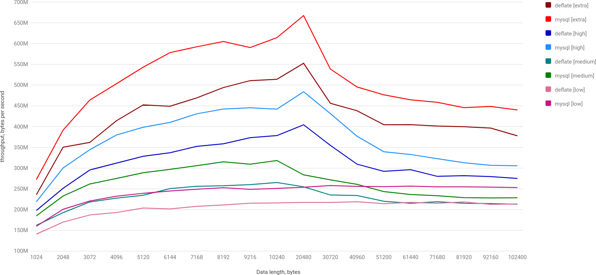

[Data compression](https://en.wikipedia.org/wiki/Data_compression) is a very broad topic, we may find lots of materials on this topic on Internet. There are [amazing](https://quixdb.github.io/squash-benchmark/) [benchmarks](http://mattmahoney.net/dc/text.html) for all kinds of compression algorithms. Benchmarks&nbsp;<sup>[1](https://github.com/ning/jvm-compressor-benchmark)&nbsp;[2](https://github.com/torao/benchmark.compression)&nbsp;[3](http://web.archive.org/web/20180715083420/http://java-performance.info/performance-general-compression/)</sup> for Java exist, but it seems to be a little bit outdated (not using JMH, for example) as it was written a long time ago.

Compression effectiveness (both performance and size) is dependent on the actual data. Therefore, it made sense to me to redo benchmarks to determine which algorithm (if any) will fit the most, and just learn a bit more about data compression in Java.

## What data do we benchmark

We are going to benchmark on two sets of data: our internal data structure of different sizes and a set of artificial randomly generated data with different compression ratios and sizes.

An internal data structure is a kind of [trie](https://en.wikipedia.org/wiki/Trie) with URLs, UUIDs and some other binary information (encoded as [protobuf](https://developers.google.com/protocol-buffers/) messages). We can't share the data itself as may contain some user data.

Random dataset is just random characters of different character sets. Here is the function to [generate data](https://github.com/dkomanov/stuff/blob/4e7dd1ff5ffc3354115b90f29ef3c14ec2ebd96b/src/com/komanov/compression/BlobCompressionRatio.java):

```java
private static java.util.Random rnd = ...;

private static byte[] generateImpl(
  byte[] alphabet,
  int length)
{
  byte[] result = new byte[length];
  for (int i = 0; i < result.length; i++) {
      result[i] = alphabet[rnd.nextInt(alphabet.length)];
  }
  return result;
}
```

For different alphabets I calculated compression ratios for [deflate](https://en.wikipedia.org/wiki/Deflate) compression algorithm and called different sets according to its compression ratio:
```
low (1.3) -> "ABCDEFGHIJKLMNOPQRSTUVWXYZabcdefghijklmnopqrstuvwxyz0123456789"
medium (2.1) -> "0123456789"
high (3.4) -> "0123"
extra high (6.2) -> "01"
```

## Compression Algorithms

I picked a few popular compression algorithms:
* [gzip](https://en.wikipedia.org/wiki/Gzip) via [Apache Commons Compress](https://commons.apache.org/proper/commons-compress/)
* [deflate](https://en.wikipedia.org/wiki/Deflate) also via commons-compress.
* [MySQL compression](https://dev.mysql.com/doc/refman/8.0/en/encryption-functions.html#function_compress): basically, it's uses deflate algorithm, but also prefixes with 4 bytes of the original data length (which helps allocating buffer for decompression). Via [java.util.zip.Deflater](https://docs.oracle.com/en/java/javase/17/docs/api/java.base/java/util/zip/Deflater.html).
* [zstd](https://github.com/facebook/zstd): Facebook's compression algorithm that's supposedly faster and has better compression ratio than deflate.
* [snappy](https://github.com/google/snappy): Google's compression algorithm that was designed to be very fast with reasonable compression ratios. Via [snappy-java](https://github.com/xerial/snappy-java).
* [brotli](https://github.com/google/brotli): Another Google's compression algorithm that aims for the better compression ratio and comparable performance with deflate. For brotli we will use 3 compression levels: 0, 6 and 11 (default, maximum). Via [Brotli4j](https://github.com/hyperxpro/Brotli4j).
* [lz4](https://lz4.github.io/lz4/): a compression algorithm that aims for the best decoding performance. For lz4 we will use 3 compression levels: fast, 9 (default), 17 (maximum). Via [lz4-java](https://github.com/lz4/lz4-java).

## Compression Ratios

For the Real dataset the best compression ratio had brotli, the worst snappy and lz4 fast:


For the Stub dataset (random) the best is brotli and the worst consistently lz4 fast.

A spreadsheet with all compression ratios is available [here](https://docs.google.com/spreadsheets/d/1pFOAgxVYsos38oraeva1_RHC9P4J3oN2Oj2fQ65L8OI).

## Benchmarks

[Benchmarks](https://github.com/dkomanov/stuff/blob/4e7dd1ff5ffc3354115b90f29ef3c14ec2ebd96b/src/com/komanov/compression/jmh/CompressionBenchmark.scala) were performed using [JMH](https://github.com/openjdk/jmh) for 3 JDKs: openjdk-8, openjdk-11 and openjdk-17. If not mentioned separately, the charts are for openjdk-17.

### Decoding on Real Data

First, let's see the performance of decoding for the Real Data (data length is between 600KB and 4MB):


Another view for this chart would be throughput in bytes per second:


From these charts it's clear that lz4 (all 3 levels) outperforms significantly all other algorithms. The next after lz4 fast are zstd and snappy.

### Encoding of Real Data

Next, let's check encoding performance for the Real Data (data length is between 600KB and 4MB):


Wow! Brotli with level 11 took 13 seconds to encode 4MB of data... At first I didn't believe it, thought that I must be use the library incorrectly. But then I ran original native binary:
```bash
$ time brotli ~/1/bins/total_4072805_with_34010_items.bin

real	0m12.945s
user	0m12.878s
sys	0m0.064s
```

Indeed, compression level 11 is extremely slow. Let's exclude it to see normally performance of other algorithms:


And the corresponding chart for the throughput (bytes per second):


4 leaders here are: lz4 fast (500+MBps), brotli_0 (450+MBps), snappy (400+MBps) and zstd (250+MBps). The worst is lz4_high17 with 13-30MBps.

### Comparing Performance for different JDKs

And comparing performance in different JDKs we may see that performance is more or less the same as most libraries use JNI under the hood:


And the same for encoding:


### Stub (random) Data

Even though compression ratios in the Real dataset are different, it's mostly 2x and higher, plus the data is not all random. It's also interesting to check how algorithms behave on more different compression ratios and more random data. So, for Stub Data let's check performance for different compression ratios.

#### lz4 fast vs snappy

Looking at throughput graphs it seems that lz4 fast compressor is a very decent alternative for snappy, when compression ratio is not very important. Decoding is faster:


As well as encoding:


However, this benchmark doesn't take into account the IO limit of the system: network/disk throughput is not infinite, so the compressor is not going to work on its best performance. I tried to emulate IO limit, but it doesn't seem to depict the reality. And for that I'm going to run another benchmark soon...

#### gzip vs deflate

Gzip and deflate have [12 bytes difference](https://stackoverflow.com/a/68538037/426397) in header/footer sizes. Apart from that gzip uses deflate to compress data. But, there is a performance difference between them!


This is very strange, because under the hood, both deflate and gzip use `Inflater`/`Deflater` classes from JDK.

#### deflate vs MySQL Compress

As I mentioned before, [MySQL Compress](https://dev.mysql.com/doc/refman/8.0/en/encryption-functions.html#function_compress) is deflate plus size of the uncompressed input. This size (extra 4 bytes) allows to allocate buffer precisely on decoding, which may save few allocations and memory copy. And it's something that we actually see on a graph:



This optimization indeed helps a lot.

#### brotli vs gzip

Brotli is supposed to be more efficient replacement for deflate/gzip. And it's :) From the performance standpoint, brotli with compression level 6 is generally faster than gzip/deflate. After certain size (in this benchmark somewhere between 20K and 30K) brotli performs significantly better:


The same goes for the encoding, but threshold is even smaller (around 3K-4K):


## Another interesting details

### Brotli

There are 3 libraries for Java:
* [org.brotli:dec](https://github.com/google/brotli): an old library by Google, last updated in 2017.
* [com.nixxcode.jvmbrotli:jvmbrotli](https://github.com/nixxcode/jvm-brotli): also old, updated in 2019.
* [com.aayushatharva.brotli4j:brotli4j](https://github.com/hyperxpro/Brotli4j): the one I used in the benchmark.

`dec` library allows only decompression (it's used for decompression only in commons-compress). I decided to benchmark it, and results are very sad:
```
Action   (algorithm) (ratio) (length)      Score  Units
decode      brotli_6  medium   102400    813.029  us/op
decode           dec  medium   102400   2220.280  us/op
decode     jvmbrotli  medium   102400   2644.517  us/op
```

### lz4

lz4 is supposed in commons-compress. A short benchmark showed that its more than 1 order of magnitude slower than `org.lz4:lz4-java` that is used in the benchmark.

```
Action  (algorithm)  (length)    Score  Units
decode    lz4_block     62830  726.496  us/op
decode   lz4_framed     62830  891.120  us/op
decode     lz4_fast     62830   30.119  us/op
decode   lz4_high17     62830   22.561  us/op
decode    lz4_high9     62830   22.075  us/op
```

## Conclusion

Even though the results of the benchmark look promising, I am not fully convinced that I will see the same level of performance in a real-life application: I briefly mentioned that IO limit of network/disk is hard to emulate, so it's hard to predict how it will behave.

Anyway,

* lz4 looks really promising and I'm looking forward to make a more comprehensive benchmark with it!
* Brotli surprised that by default it uses maximum compression which is extremely slow. And what surprised me even more, that decoding speed of highly compressed data is also slower. Which makes some compression level in the middle a much better choice.
* Zstd stands somewhere in the middle in terms of performance and compression ratio.

Another interesting point for me is that artificial data (random) shows more or less the same trends for compression algorithms, but the real data is decompressed faster for the same compression ratio (lz4 level 17 for real data ~69 usec vs ~88 usec). So, it's important to benchmark on the real data samples if possible.


Play with charts [here](/charts/java-compression). Source code is on [GitHub](https://github.com/dkomanov/stuff/tree/4e7dd1ff5ffc3354115b90f29ef3c14ec2ebd96b/src/com/komanov/compression). Originally posted on [Medium](TBD). [Cover image](https://pixabay.com/photos/water-pump-manometer-pressure-gauge-7177350/) by [indoposter](https://pixabay.com/users/indoposter-24870892/) from [Pixabay](https://pixabay.com/).
