What's the best way to store binary data in [MySQL](https://www.mysql.com/)? This is a question that has multiple answers, depending on what you want to achieve. For example, if you need to optimize for the storage size, you probably need to use some compression algorithm that compresses your data efficiently. In my case, I really need the best performance, meaning the fastest response time to fetch the entire blob from MySQL.

Let's put aside the question of whether MySQL is a good fit for [storing binary data](https://dba.stackexchange.com/questions/2445/should-binary-files-be-stored-in-the-database). The question here, is how to store binary data so the reads from DB are as fast as possible?

The solution might be to use data compression. However, this is something that requires benchmarking, as there is a trade off between using CPU for decompression and network speed. In this benchmark I am going to compare performance between different compression algorithms, compression using MySQL itself and not using compression at all.

## Benchmark Environment

This benchmark is slightly less micro and slightly more complicated than my usual benchmarks. We have 3 major parameters here: MySQL Server, network between MySQL and Application and compression algorithms.

### Datasets and Compression Algorithms

Because this blog post is a continuation of my previous one -- [Java Compression Performance](/p/java-compression-performance), I'm going to use the same compression algorithms and datasets as there. Let's briefly describe it.

In short, there are 2 datasets:
* One is based on the real user data, contains URLs, UUID etc.
* Another is [purely random](https://github.com/dkomanov/stuff/blob/4e7dd1ff5ffc3354115b90f29ef3c14ec2ebd96b/src/com/komanov/compression/BlobCompressionRatio.java), using different alphabet sizes to achieve different compression ratios.

Application level compression using these algorithms: [gzip](https://en.wikipedia.org/wiki/Gzip), [deflate](https://en.wikipedia.org/wiki/Deflate), [MySQL compression](https://dev.mysql.com/doc/refman/8.0/en/encryption-functions.html#function_compress), [zstd](https://github.com/facebook/zstd), [snappy](https://github.com/google/snappy), [brotli](https://github.com/google/brotli) and [lz4](https://lz4.github.io/lz4/).

In additional to application-level compression, we're going to use internal [MySQL compression](https://dev.mysql.com/doc/refman/8.0/en/innodb-compression-internals.html) as well.

Compression ratios for different algorithms and datasets you may explore in [this spreadsheet](https://docs.google.com/spreadsheets/d/1pFOAgxVYsos38oraeva1_RHC9P4J3oN2Oj2fQ65L8OI).

### BLOB in MySQL

MySQL has [BLOB](https://dev.mysql.com/doc/refman/8.0/en/blob.html) column type which allows to store binary data (check [docs](https://dev.mysql.com/doc/refman/8.0/en/storage-requirements.html#data-types-storage-reqs-strings) for the maximum length, and also [few tips](https://dev.mysql.com/doc/refman/8.0/en/optimize-blob.html) for using BLOB).

Another aspect is the MySQL's storage [row format](https://dev.mysql.com/doc/refman/8.0/en/innodb-row-format.html). Depending on row format, MySQL stores data differently.
* `DYNAMIC` row format for `BLOB` stores 20-byte pointer to where it's stored. As opposed to `REDUNDANT` and `COMPACT` row formats, which store first 768 bytes in a table and the rest in overflow pages. In this benchmark data sizes start from 1028 bytes, so this kind of optimization is irrelevant.
* `COMPRESSED` row format enables [compression](https://dev.mysql.com/doc/refman/8.0/en/innodb-compression-internals.html) on database level, so 20-byte pointer will point to another storage which will be compressed using [deflate with 4-byte length prefix](https://dev.mysql.com/doc/refman/8.0/en/encryption-functions.html#function_compress). For the benchmark sake we will use the same algorithm on application level to see the overhead of MySQL over compression. You may find useful another blog post with overview of [MySQL compression](https://medium.com/datadenys/data-compression-in-mysql-6a0668af8f08).

So, the first table structure we're going to use is this:
```sql
CREATE TABLE `uncompressed_blobs` (
  `id` INT NOT NULL PRIMARY KEY,
  `data` MEDIUMBLOB NOT NULL
) ENGINE=InnoDB ROW_FORMAT=DYNAMIC;
```

In this table we will store either uncompressed data or data compressed on an application level without using MySQL compression (obviously, we want to avoid double compression as it ineffective).

And another table for benchmarking MySQL's compression:
```sql
CREATE TABLE `compressed_blobs` (
  `id` INT NOT NULL PRIMARY KEY,
  `data` MEDIUMBLOB NOT NULL
) ENGINE=InnoDB ROW_FORMAT=COMPRESSED;
```

### Network and Hardware

For this benchmark I ended up with 4 different configurations:
* `localhost`. This is the most naive and "in a vacuum" configuration. Both JMH benchmark and MySQL were run on a same laptop (i7-1165G7, 16GB RAM, Ubuntu 22). This configuration provides the best "network" latencies, and allegedly without too much contention, as 2 threads were used for the JMH benchmark and the rest for MySQL (which was underutilized anyway).
* `AWS`. I used the actual production cluster of MySQL Server with master/slaves with [proxysql](https://proxysql.com/) in front of it. JMH benchmark was run on a separate server inside the same region.
* `1Gbit` is so-called configuration that I ran on my home network. MySQL server was installed on an old computer with Atom processor, and a JMH benchmark was run from another laptop (i7-U10610U, 32GB RAM, Ubuntu 20).
  * First run using Wi-Fi.
  * And another one using Ethernet (I don't have Ethernet port on a laptop from `localhost` configuration)

Because compression performance doesn't really depend on JDK version (as I shown in my [previous benchmark](/p/java-compression-performance)), I used different versions of JDK (openjdk-11 in `AWS` and openjdk-17 on my laptops).

## Benchmarks

For this benchmark the most important metric is a throughput: how many bytes of uncompressed data we can get in a second. Response time can't show a meaningful result because it doesn't include compression ratio.

### Benchmarks for AWS configuration

I'd guess that the most interesting results are for `AWS` configuration as it's closest to a potential production use case.

Here we may see the throughput chart for real dataset and data sizes between 600KB and 4MB:

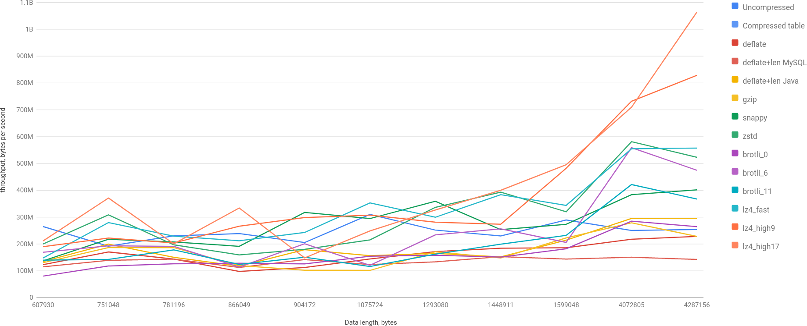

Let's highlight the best:

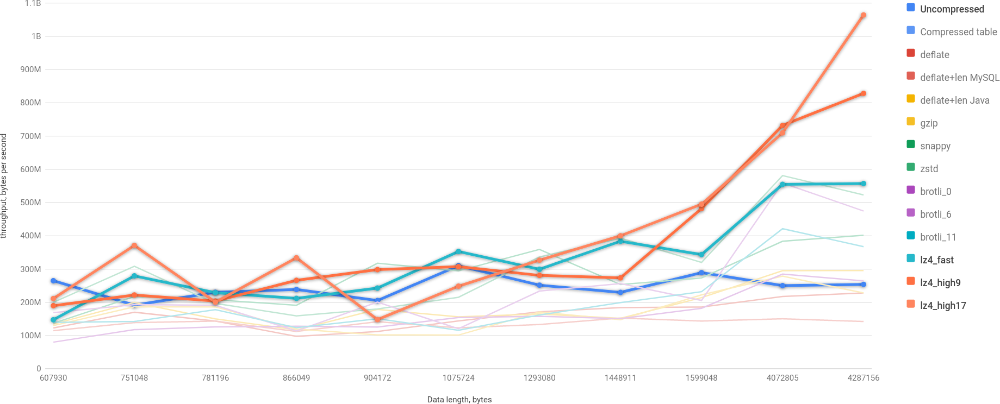

You may see, that lz4 takes the lead over uncompressed BLOB and every other algorithm is slower. Bigger the BLOB, the difference is more significant.

Let's take a look on a smaller dataset -- 34KB to 94KB:

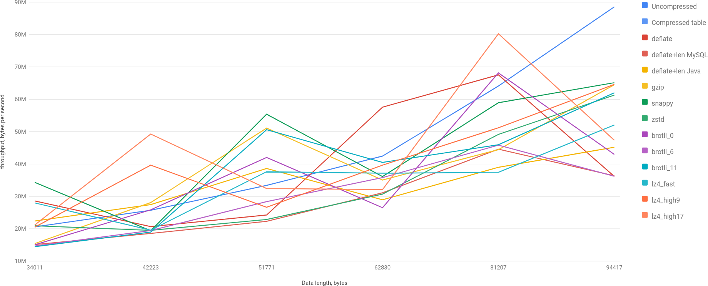

The picture is more interesting here, but it's mostly because compression ratio for lz4 for particular examples is significantly worse. However, it's important to note this -- compression ratio matters a lot. And to illustrate this point let's check the performance for random dataset for different compression ratios:

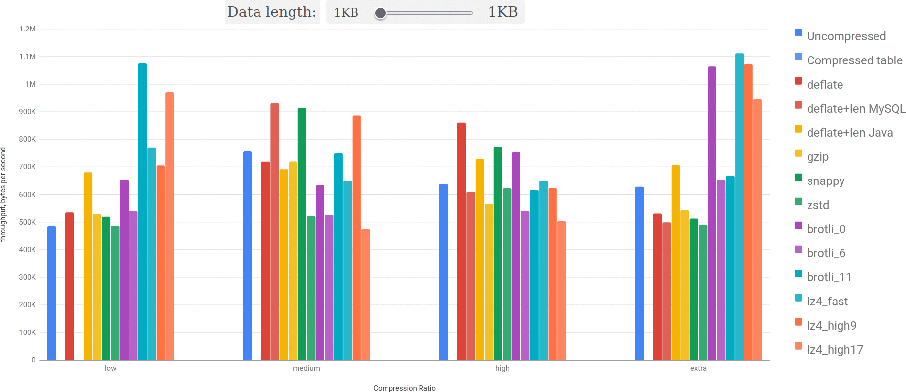

You may see: bigger the size and better the compression ratio -- lz4 outperforms everything else more and more.

### Benchmarks for localhost

What `localhost` benchmark really shows is the ideal case in which network is as fast as possible.

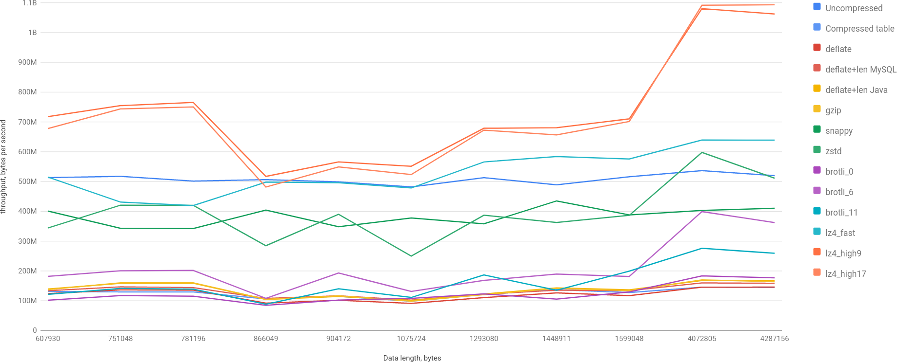

We may see that uncompressed performance is better than any other algorithm significantly except for lz4.

If you remember, on the chart from `AWS` configuration for mid-sized BLOBs lz4 didn't perform as well something (because of bad compression ratio). However, when you improve throughput of MySQL (network), lz4 continues to shine:

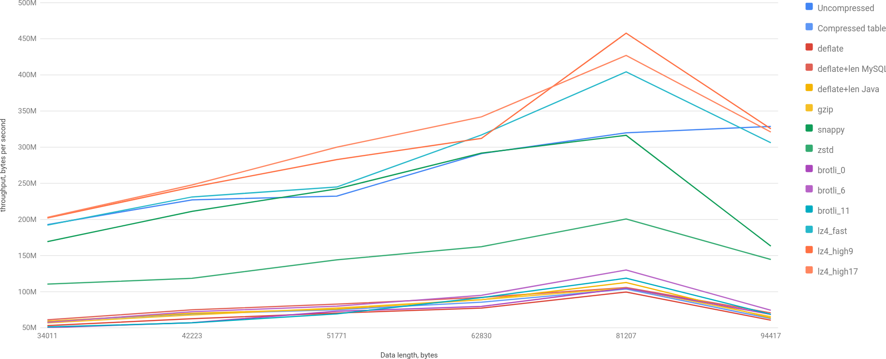

### Benchmarks for local network and weak server

Even though it is pretty much unlikely to encounter such configuration in a real production environment, it may show something interesting.

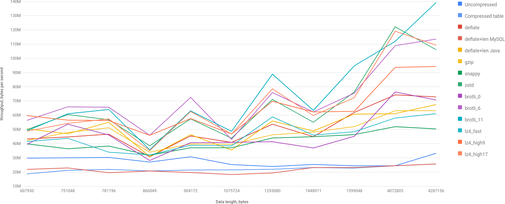

Here we clearly see that uncompressed BLOB gives about 30MB/sec, and for that it's hard to show any good results for fast algorithms. And in such circumstances brotli shines as it has the best compression ratio among all algorithms, so the poor throughput of MySQL is well compensated by a big compression ratio and reasonable decoding performance (I want to remind you, that 11th level of brotli is extremely slow on encoding).

### Comparisons

I also did a few interesting (in my view) comparisons.

#### MySQL Compression Algorithm

The first comparison is between `ROW_FORMAT=COMPRESSED` and using `UNCOMPRESS` function of MySQL over compressed data in `ROW_FORMAT=DYNAMIC`. Basically, we compare how storage is organized versus simple uncompression.

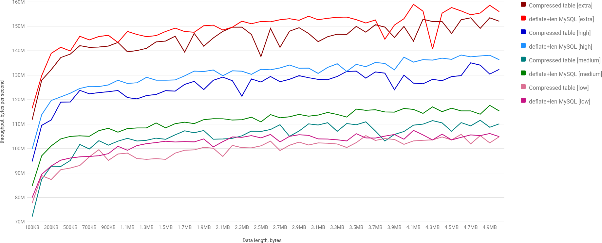

Interestingly enough, doing `SELECT UNCOMRESS(data)` is slightly faster than uncompressing data automatically from the storage itself.

The next step is to compare getting uncompressed data from MySQL via `SELECT UNCOMPRESS(data)` and getting compressed data from MySQL and uncompressing it in an application itself. Basically, MySQL vs network+Java :)

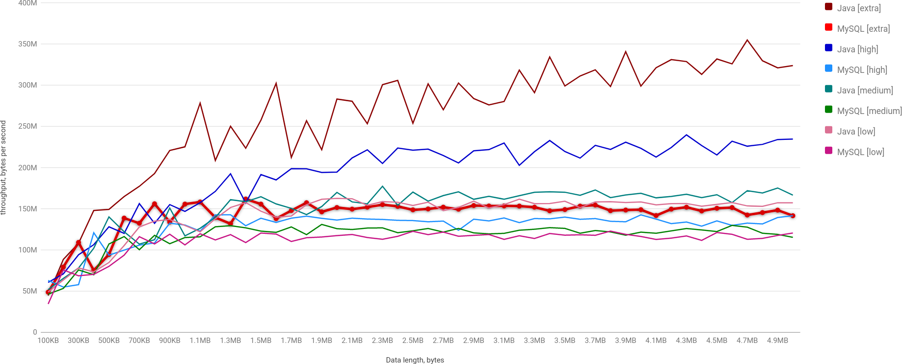

As expected, lower network usage is very beneficial: uncompressing in Java is significantly faster. But with an ideal network (namely `localhost`), it's not really the case:

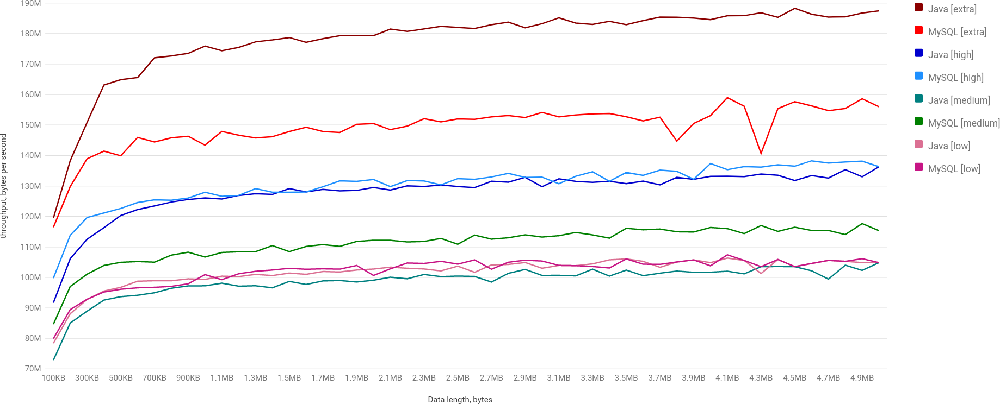

We may see that only for highest compression ratios Java wins. In other cases MySQL is faster. Which probably means that `UNCOMPRESS` implementation from MySQL is faster (it makes sense as Java does plenty of memory copy and some allocations).

### lz4 vs Uncompressed

Let's take a slightly closer look on lz4 and uncompressed, as they are clear winners in `localhost` and `AWS` configurations. Here is the small animation to see lz4 vs uncompressed in all configurations:

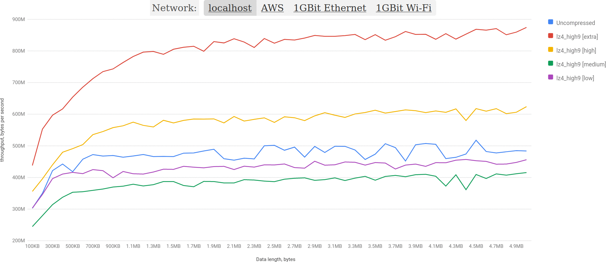

And here is lz4 vs uncompressed for `AWS` configuration. Uncompressed is highlighted, so it's obvious that lz4 wins clearly:

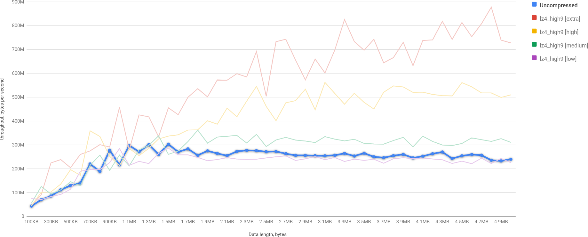

## Conclusion

For our particular use case lz4 looks very promising. When the compression ratio is not good, it loses slightly, but generally it outperforms anything else. The next option is not using compression at all.

But it's very important to remember that application level compression has some downsides:
* Data can't be used within database. So, if you, for example, store JSON in a BLOB, you won't be able to use JSON functions.
* It moves CPU computations from MySQL to your application (which could be an upside in some cases as well).
* It requires more effort from the application side.

The next thing to be aware of is a compression ratio. Know you data, benchmark over your data, as the performance depends on an actual compression ratio significantly.

And the last thing -- a configuration of your environment also may affect the decision greatly, as for slower servers benchmark shows completely opposite results (maybe not completely, but close to it).


Play with charts [here](/charts/mysql-blog-fetch). Source code is on [GitHub](). Originally posted on [Medium](TBD). Cover image by [DALL-E](https://openai.com/dall-e-2/): "a manometer with pipe with a dolphin on a background, 3d render" (yay! First time I managed to get something from it, even though it's still not 100%-pretty :)).
