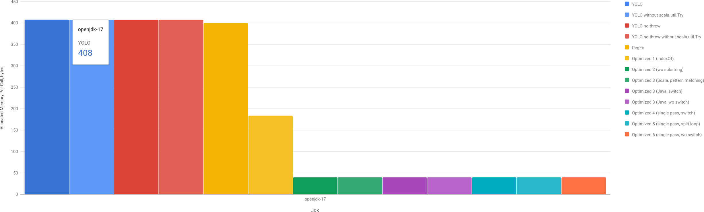
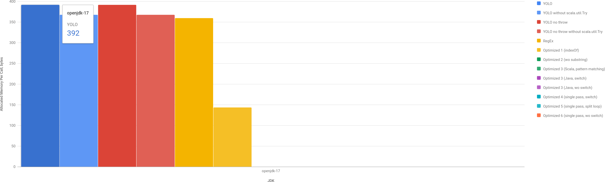

For some time I wanted to write a blog post about performance optimizations: a step by step guide how to improve performance of some small portion of code. Something like I did in the past -- [Micro-optimization for UUID.fromString in 7 steps](/p/micro-optimization-for-uuid-fromstring-in-7-steps). And recently I finally found an example from the actual production code, so it won't be a made up challenge to improve something bad, but something potentially useful :)

Here I want to demonstrate on a fairly simple example many different aspects of code and how it's possible to optimize it as much as possible, step by step improving performance by rewriting, redesigning and rewriting again. Without further ado, let's start!

## What Are We Benchmarking?

Use case is very simple, we have this data structure:
```scala
case class Version(major: Int, minor: Int, fix: Int) {
  override def toString: String = s"$major.$minor$.fix"
}
```

Each part of Version is a number between 0 and 10000. A string representation of `Version(1, 0, 0)` would be `"1.0.0"`. No semantic versioning, no hyphens etc. Just 2 dots and 3 numbers. And there's a code for parsing this string representation:

```scala
def parse(v: String): Option[Version] = Try {
  val numbers@Array(major, minor, fix) = v.split('.').map(_.toInt)
  if (numbers.exists(num => num < 0 || num > MaxVersionSize)) {
    throw new RuntimeException(v)
  }
  Version(major, minor, fix)
}.toOption
```

## Let's Optimize!

First, we need to benchmark this code with different inputs:
```
Benchmark       (encoded)  Mode  Cnt     Score     Error  Units
yolo        200.200.99999  avgt    5  2133.263 ± 218.761  ns/op
yolo                1.0.0  avgt    5   163.856 ±  12.370  ns/op
```

### Step 1. Exceptions Are Expensive

In the code above we have `Try(...).toOption`, which means that we ignore all exceptions. If there's any exception we consider this version invalid -- `None`. But we know that exceptions are [very expensive](https://shipilev.net/blog/2014/exceptional-performance/). And the depth of the stack trace makes it more and more expensive. In this case stack trace is very small: it's a JMH benchmark, so depth is smaller than 20, in a real application it would be significantly larger, meaning even slower. Let's get rid of a `throw` statement, which is easy:

```scala
Try {
  val numbers@Array(major, minor, fix) = v.split('.').map(_.toInt)
  if (numbers.exists(num => num < 0 || num > MaxVersionSize))
    None
  else
    Some(Version(major, minor, fix))
}.toOption.flatten
```

This version's benchmarks improved a bit for this particular case:
```
Benchmark       (encoded)  Mode  Cnt     Score     Error  Units
yolo        200.200.99999  avgt    5  2133.263 ± 218.761  ns/op
yoloNoThrow 200.200.99999  avgt    5   192.138 ±   1.144  ns/op
yolo                1.0.0  avgt    5   163.856 ±  12.370  ns/op
yoloNoThrow         1.0.0  avgt    5   163.308 ±  10.761  ns/op
```

### Step 1.5. More Issues To Solve

Well, we solved one case, but not the only one. Let's see what we actually do here. All the relevant pieces in this single line of code:

```scala
val numbers@Array(major, minor, fix) = v.split('.').map(_.toInt)
```

Let's break it down.

1. `v.split('.')` iterates over entire String, finds dots and creates an array of Strings. To create array it uses intermediate `ArrayList`. So, it allocates at least 2 times more memory than needed.
2. `.map(_.toInt)` creates an Array of Int, parses all the split parts (meaning, iterates over each String again). `toInt` (which is just `Integer.parseInt`) may throw an exception.
3. `numbers@Array(major, minor, fix)` extracts 3 elements from an array, if array length is not 3 -- throws an exception.
4. Also, there is `Try(...).toOption`...

### Step 3. Remove scala.util.Try

It's a simple one, just replace `scala.util.Try` with a regular `try` and `catch`:

```scala
try {
  val numbers@Array(major, minor, fix) = v.split('.').map(_.toInt)
  if (numbers.exists(num => num < 0 || num > MaxVersionSize))
    None
  else
    Some(Version(major, minor, fix))
} catch {
  case _: Throwable => None
}
```

And a benchmark for it:

```
Benchmark       (encoded)  Mode  Cnt     Score     Error  Units
yolo                1.0.0  avgt    5   163.856 ±  12.370  ns/op
yoloNoTry           1.0.0  avgt    5   164.512 ±   5.407  ns/op
yoloNoThrow         1.0.0  avgt    5   163.308 ±  10.761  ns/op
yoloNoThrowNoTry    1.0.0  avgt    5   166.721 ±   1.802  ns/op
```

It's slightly slower, but error is smaller (less deviations).

### Step 4. Regex

Any parsing problem (especially for [HTML](https://stackoverflow.com/questions/590747/using-regular-expressions-to-parse-html-why-not)) could be solved with regular expressions!

```scala
private val MyRegex = Pattern.compile("(\\d{1,5})\\.(\\d{1,5})\\.(\\d{1,5})")

...

val m = MyRegex.matcher(v)
if (m.matches()) {
  val major = m.group(1).toInt
  val minor = m.group(2).toInt
  val fix = m.group(3).toInt
  if (major > MaxVersionSize || minor > MaxVersionSize || fix > MaxVersionSize)
    None
  else
    Some(Version(major, minor, fix))
} else {
  None
}
```

This solution is also quite readable, it doesn't throw exceptions as regular expression validates correct non-negative numbers, so `toInt` won't fail.

```
Benchmark       (encoded)  Mode  Cnt     Score     Error  Units
yoloNoThrow     200.200.a  avgt    5  3156.323 ± 219.461  ns/op
regex           200.200.a  avgt    5   251.237 ±  13.064  ns/op
yoloNoThrow         1.0.0  avgt    5   163.308 ±  10.761  ns/op
regex               1.0.0  avgt    5   216.829 ±   0.991  ns/op
```

For errors this version does the trick -- no exceptions, so errors aren't as slow, but the happy flow is slower! Not good!

### Step 5. Searching For Dots (use indexOf)

The code is straight-forward, but verbose a bit:
* indexOf 3 times to find `.` character (the 3rd one to verify there isn't more).
* Check that 3 regions are numbers.
* parseInteger for 3 regions.

```scala
def parseOptimized1(v: String): Option[Version] = {
  val index1 = v.indexOf('.')
  if (index1 == -1) {
    return None
  }

  val index2 = v.indexOf('.', index1 + 1)
  if (index2 == -1) {
    return None
  }

  if (v.indexOf('.', index2 + 1) != -1) {
    return None
  }

  if (!isNumber3(v, 0, index1) ||
      !isNumber3(v, index1 + 1, index2) ||
      !isNumber3(v, index2 + 1, v.length)) {
    return None
  }

  val majorStr = v.substring(0, index1)
  val minorStr = v.substring(index1 + 1, index2)
  val fixStr = v.substring(index2 + 1)

  val major = majorStr.toInt
  val minor = minorStr.toInt
  val fix = fixStr.toInt

  if (major > MaxVersionSize || minor > MaxVersionSize || fix > MaxVersionSize)
    None
  else
    Some(Version(major, minor, fix))
}
```

And benchmarks:
```
Benchmark       (encoded)  Mode  Cnt     Score     Error  Units
yoloNoThrow     200.200.a  avgt    5  3156.323 ± 219.461  ns/op
regex           200.200.a  avgt    5   251.237 ±  13.064  ns/op
optimized1      200.200.a  avgt    5    34.619 ±   0.116  ns/op
yoloNoThrow         1.0.0  avgt    5   163.308 ±  10.761  ns/op
regex               1.0.0  avgt    5   216.829 ±   0.991  ns/op
optimized1          1.0.0  avgt    5   100.512 ±   4.974  ns/op
```

Good! Finally, we improved both error flow and success flow. Can we improve it more, though?

### Step 6. Replace substring

The problematic part is this:

```scala
val majorStr = v.substring(0, index1)
val major = majorStr.toInt
```

Here we do `substring` and then calling `parseInteger`. If you use JDK 9 or higher, you may use a new overload that takes `beginIndex` and `endIndex` arguments, so you can bypass creating a redundant `String` instance. The fix looks like this:

```scala
val major = Integer.parseUnsignedInt(v, 0, index1, 10)
val minor = Integer.parseUnsignedInt(v, index1 + 1, index2, 10)
val fix = Integer.parseUnsignedInt(v, index2 + 1, len, 10)
```

And the benchmark (only for happy flows):

```
Benchmark           (encoded)  Mode  Cnt     Score     Error  Units
yoloNoThrow             1.0.0  avgt    5   163.308 ±  10.761  ns/op
regex                   1.0.0  avgt    5   216.829 ±   0.991  ns/op
optimized1              1.0.0  avgt    5   100.512 ±   4.974  ns/op
optimized2              1.0.0  avgt    5    63.764 ±   4.887  ns/op

yoloNoThrow 10000.10000.10000  avgt    5   209.066 ±   1.968  ns/op
regex       10000.10000.10000  avgt    5   384.005 ±   1.439  ns/op
optimized1  10000.10000.10000  avgt    5   156.005 ±   5.058  ns/op
optimized2  10000.10000.10000  avgt    5   115.824 ±   5.485  ns/op
```

It's quite significant: ~50% faster.

### Step 7. Almost There?

However, we still have a problem - we actually go over initial string 3 times:
1. Find all dots.
2. Check that there are only digits between dots.
3. Parse numbers.

My first approach to eliminate one of these redundant passes failed miserably: I tried to go over String using pattern matching for each character, and ended up with slightly less performant solution:

```
Benchmark           (encoded)  Mode  Cnt     Score     Error  Units
optimized1  10000.10000.10000  avgt    5   156.005 ±   5.058  ns/op
optimized2  10000.10000.10000  avgt    5   115.824 ±   5.485  ns/op
optimized3  10000.10000.10000  avgt    5   120.257 ±   0.252  ns/op
```

As it goes, I rewrote it to Java and got expected performance boost:

```
Benchmark           (encoded)  Mode  Cnt     Score     Error  Units
optimized1  10000.10000.10000  avgt    5   156.005 ±   5.058  ns/op
optimized2  10000.10000.10000  avgt    5   115.824 ±   5.485  ns/op
optimized3  10000.10000.10000  avgt    5   120.257 ±   0.252  ns/op
optimd3Java 10000.10000.10000  avgt    5   107.327 ±   3.675  ns/op
```

Here is the loop (in Java):

```java
final int len = v.length();
int major = -1;
int minor = -1;
int lastDotIndex = -1;

for (int i = 0; i < len; ++i) {
    char ch = v.charAt(i);
    switch (ch) {
        case '0': case '1': case '2': case '3': case '4':
        case '5': case '6': case '7': case '8': case '9':
            if (i - (lastDotIndex + 1) > 5) {
                return null; // longer than MaxVersionSize
            }
            break;

        case '.':
            if (major == -1) {
                int parsed = parseIntSafeEmpty(v, 0, i);
                if (parsed == -1 || parsed > MaxVersionSize) {
                    return null;
                }
                major = parsed;
            } else if (minor == -1) {
                int parsed = parseIntSafeEmpty(v, lastDotIndex + 1, i);
                if (parsed == -1 || parsed > MaxVersionSize) {
                    return null;
                }
                minor = parsed;
            } else {
                return null; // 3rd dot
            }
            lastDotIndex = i;
            break;

        default:
            return null; // invalid character
    }
}
```

Here we validate digits and find dots in a single pass. Parsing is still requires the second pass over the same characters.

### Step 8. Don't use switch

Inside for loop we can try to use `if..else` instead of `switch`:

```java
char ch = v.charAt(i);
if (ch >= '0' && ch <= '9') {
    if (i - (lastDotIndex + 1) > 5) {
        return null; // longer than MaxVersionSize
    }
} else if (ch == '.') {
    if (major == -1) {
        int parsed = parseIntSafeEmpty(v, 0, i);
        if (parsed == -1 || parsed > MaxVersionSize) {
            return null;
        }
        major = parsed;
    } else if (minor == -1) {
        int parsed = parseIntSafeEmpty(v, lastDotIndex + 1, i);
        if (parsed == -1 || parsed > MaxVersionSize) {
            return null;
        }
        minor = parsed;
    } else {
        return null; // 3rd dot
    }
    lastDotIndex = i;
} else {
    return null; // invalid character
}
```

And it actually gives another performance boost!

```
Benchmark                       (encoded)  Mode  Cnt     Score     Error  Units
optimized3Java          10000.10000.10000  avgt    5   107.327 ±   3.675  ns/op
optimized3JavaNoSwitch  10000.10000.10000  avgt    5    97.115 ±   4.890  ns/op
```

### Step 9. Single pass!

Finally, instead of parsing integers from String we need to accumulate digits as we read them. It adds some complexity, but not really much. Here is the final code for parsing version:

```java
final int len = v.length();

int major = 0;
int minor = 0;

int current = 0;
int dots = 0;
int lastDotIndex = -1;

for (int i = 0; i < len; ++i) {
    final char ch = v.charAt(i);
    int digit = ch - 48;
    if (digit == -2) {
        if (lastDotIndex + 1 == i) {
            return null;
        }

        if (current < 0 || current > MaxVersionSize) {
            return null;
        }

        switch (dots) {
            case 0:
                major = current;
                dots = 1;
                break;

            case 1:
                minor = current;
                dots = 2;
                break;

            default:
                return null;
        }

        lastDotIndex = i;
        current = 0;
    } else if (digit < 0 || digit > 9) {
        return null;
    } else {
        // overflow is possible!
        current = current * 10 + digit;
    }
}

if (dots != 2 || lastDotIndex == len - 1) {
    return null;
}
if (current < 0 || current > MaxVersionSize) {
    return null;
}

return new Version(major, minor, current);
```

And the benchmark:

```
Benchmark                       (encoded)  Mode  Cnt     Score     Error  Units
yoloNoThrow             10000.10000.10000  avgt    5   209.066 ±   1.968  ns/op
regex                   10000.10000.10000  avgt    5   384.005 ±   1.439  ns/op
optimized1              10000.10000.10000  avgt    5   156.005 ±   5.058  ns/op
optimized2              10000.10000.10000  avgt    5   115.824 ±   5.485  ns/op
optimized3Java          10000.10000.10000  avgt    5   107.327 ±   3.675  ns/op
optimized3JavaNoSwitch  10000.10000.10000  avgt    5    97.115 ±   4.890  ns/op
optimized6              10000.10000.10000  avgt    5    57.729 ±   1.709  ns/op
```

4 times faster from the initial implementation!

## The End? Let's Talk About Memory

I mentioned at the beginning of this journey memory allocations that we have in `split` method -- to for Array of strings and for the intermediate `ArrayList`. I ran JMH benchmark with profiler of GC (`-prof gc`) to see how much memory different implementations allocate.



Original and Regex versions allocate similar amount of memory -- around 400 bytes per call (for a happy flow, obviously, for exceptions we need to allocate significantly more). First optimized version (Step 5) allocates 184 bytes and other optimized implementations allocate 40 bytes.

40 bytes is what we need for `Option[Version]`. According to [JOL](https://github.com/openjdk/jol):
* `scala.Some` takes 16 bytes: 12 bytes for header + 4 bytes for a reference.
* `Version` takes 24 bytes: 12 bytes for header + 12 bytes for 3 integers.

### Step 10. Get Rid of Option[Version]

Because each version part is limited to 10000, each integer needs only 14 bits (2^14 = 16384 = 16K). One `long` can hold even 4 such integers! So, let's try to pack everything into `long`! We can even put a bit for "invalid" (to simulate `None`).

```scala
private val BitsPerValue = MaxVersionSize.toBinaryString.length
require(BitsPerValue * 3 + 1 <= 64, "not enough bits")
private val InvalidBit = 1L << (3 * BitsPerValue + 1)

val Invalid: Long = InvalidBit

def version(major: Int, minor: Int, fix: Int): Long = {
  ((major & 16383).toLong << 28) |
    ((minor & 16383).toLong << 14) |
    (fix.toLong & 16383)
}
```

And now instead of returning `Option[Version]` we need to return `long` and just replace `None` or `null` with `Invalid` and `Some(Version(...))` with `version(...)`!



Yes, now we see that after [Step 5](#step-5-searching-for-dots-use-indexof) we managed to remove allocations completely! And what's about performance without any allocations?

```
Benchmark                       (encoded)  Mode  Cnt     Score     Error  Units

yolo                    10000.10000.10000  avgt    5   218.728 ±   2.026  ns/op
yolo NO ALLOC           10000.10000.10000  avgt    5   211.766 ±  19.489  ns/op

optimized1              10000.10000.10000  avgt    5   156.005 ±   5.058  ns/op
optimized1 NO ALLOC     10000.10000.10000  avgt    5   146.182 ±   0.199  ns/op

optimized6              10000.10000.10000  avgt    5    57.729 ±   1.709  ns/op
optimized6 NO ALLOC     10000.10000.10000  avgt    5    46.327 ±   0.065  ns/op
```

As expected, it improved performance even more. By the way, it's as significant for the short string:

```
Benchmark                       (encoded)  Mode  Cnt     Score     Error  Units

yolo                                1.0.0  avgt    5   163.856 ±  12.370  ns/op
yolo NO ALLOC                       1.0.0  avgt    5   164.106 ±  17.569  ns/op

optimized1                          1.0.0  avgt    5   100.512 ±   4.974  ns/op
optimized1 NO ALLOC                 1.0.0  avgt    5    91.981 ±   3.188  ns/op

optimized6                          1.0.0  avgt    5    22.198 ±   0.051  ns/op
optimized6 NO ALLOC                 1.0.0  avgt    5    20.232 ±   0.054  ns/op
```

### Valhalla FTW!

Project [Valhalla](https://jdk.java.net/valhalla/) is going to help us greatly with this zero-allocation solution as it will enable to not pay for allocations for such simple data structures, but also it will make it convenient to use. With the current approach we return `long`, and it's not really clear for a code reader to understand what this long actually means.

With value-classes it will be possible to define version like this:

```java
value class Version {
  private long value;

  public static final Version INVALID = new Version(1L << (3 * 14 + 1));

  private Version(long value) {
    this.value = value;
  }

  public Version(int major, int minor, int fix) {
    this(asValue(major, minor, fix));
  }

  public static Version fromString(String v) {
    // our implementation
  }

  public boolean isInvalid() {
    return value == INVALID.value;
  }

  public int major() {
    return (int) ((value >> 28) & 16383);
  }

  public int minor() {
    return (int) ((value >> 14) & 16383);
  }

  public int fix() {
    return (int) (value & 16383);
  }

  private static long asValue(int major, int minor, int fix) {
    return (((long) (major & 16383)) << 28) |
      (((long) (minor & 16383)) << 14) |
      ((long) (fix & 16383));
  }  
}
```

Effectively it will be just 8 bytes in memory, not in heap, passing by value, as effective as `long`, but with the convenience of the normal class. We just need to patiently wait for Valhalla :)

## Final Thoughts

Clearly, the initial code is concise and simple. And sometimes we pay for the simplicity and the ease of maintenance. Do we even need to optimize it? If it works -- no need to touch it. In my case, my attention was brought to this code because of the exceptions. By chance I profiled service with [async-profiler](https://github.com/async-profiler/async-profiler) and at that point of time we received significant amount of requests with invalid versions, so exceptions thrown by this validation were visible in hot spots.

It's still may not be a reason for optimizations. If we are just concerned with exceptions, we may as well use [Regex](#step-4-regex) implementation. It's not as robust on happy flow, but still good enough. And it has more or less the same readability.

My internal perfectionist screams: "What's about efficiency?!" But it's always a trade off between maintenance cost and actual production impact of code changes. [Step 6](#step-6-replace-substring) actually may be a good compromise between readability and performance, as `indexOf` solution is not that complicated and still provides visible performance benefit (no garbage also!)

## Conclusion

I had a lot of fun conducting this benchmark and doing all these optimizations step by step. I hope you enjoyed it as well. To sum up optimization efforts:
* As always, [beware](http://wiki.jvmlangsummit.com/images/1/1d/PerformanceAnxiety2010.pdf) of premature optimizations!
* Use as less exceptions as possible. If you need to use exceptions, consider using [stack-traceless](https://stackoverflow.com/questions/11434431/exception-without-stack-trace-in-java) ones.
* Reduce number of intermediate allocations to minimum. It will not only improve performance of the task, but will reduce pressure on Garbage Collector, which is a good thing for the application in general.
* CPU cycles do matter. Iterating over a string has its price. More iterations you do, more you pay.
* Consider maintenance cost of the optimization. It could be detrimental in a long run.

But more than anything, optimization and benchmarking are always a fun exercise -- have fun! ;-)


Play with charts [here](/charts/version-parsing). Source code is on [GitHub](https://github.com/dkomanov/stuff/commit/85e5845688922ecce4ccc88818c9e283174f8705). Originally posted on [Medium](TBD). [Cover image](https://pixabay.com/illustrations/matrix-code-computer-pc-data-356024/) by [51581](https://pixabay.com/users/51581-51581/) from [Pixabay](https://pixabay.com/) + [Excalidraw](https://excalidraw.com/).
